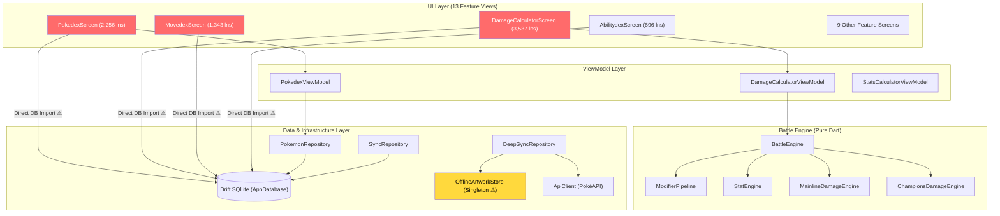
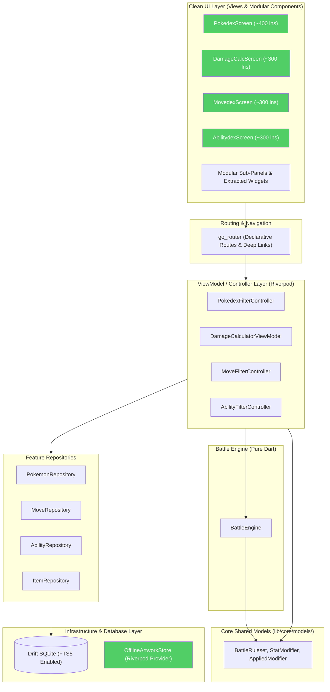

# LibreDex — Frozen Document Archive

> [!WARNING]
> **This file is an archive. Nothing in it is current.**
> It exists so that historical reasoning stays searchable after the living documents
> move on. Do not edit it, do not action it, do not cite it as current state.
>
> **The current roadmap is [`plans.md`](../plans.md) at the repository root.**

## Why this file exists

LibreDex accumulated one point-in-time audit per cycle (August 2026, October 2026).
Each was accurate when written and each was silently superseded by the next, while
both stayed in the repository root looking equally authoritative. That produced two
failure modes:

1. A reader could not tell which document was in force.
2. Recommendations that survived an entire regeneration cycle unchanged — most
   notably "split the God Screens" — kept being re-derived instead of being
   recognised as *too big to start* and needing a different approach.

This archive terminates the ambiguity. Everything below is frozen at the date in its
banner. New audits do not get appended here; the roadmap is updated instead, and this
file is only ever extended with documents that have been formally retired.

> **One deviation from verbatim:** Document 1 originally contained three links of the
> form `file:///home/thedragon/StudioProjects/LibreDex/...` — absolute paths to a
> developer's local machine. These were rewritten to repository-relative paths
> (`../lib/...`). No other content has been altered.

## Contents

| # | Document | Written | Retired | Why retired |
|:---:|---|:---:|:---:|---|
| 1 | [Analysis & Rebuild Plan](#document-1-of-2--libredex--perfect-analysis--rebuild-plan) | 2026-08-08 | 2026-10-06 | Superseded by Document 2. Its three "if you do nothing else" items are now tracked in `plans.md` §Completed. |
| 2 | [Master Architecture, Refactoring & Rebuild Plan — v1](#document-2-of-2--libredex--master-architecture-refactoring--rebuild-plan) | 2026-10-06 | 2026-10-06 | Superseded the same day by `plans.md` v2 after line-by-line verification against the tree. See the correction log in `plans.md` §G for the specific errors it contained. |

## Reading guide

Document 1 is worth reading for its navigation analysis and the rationale behind the
66 Stat Points correction — both are decisions already shipped, and the reasoning is
still the best record of *why*. Document 2 is worth reading only as a measurement
baseline: its inventory of the codebase is accurate, its diagnosis and prioritisation
are not.

---

<!-- ==================== DOCUMENT 1 ==================== -->

<a id="document-1-of-2--libredex--perfect-analysis--rebuild-plan"></a>

# LibreDex — Perfect Analysis & Rebuild Plan
### Arena Session `arena/019fe2af-libredex` — 08 Aug 2026
> You are right: **the navigation IS redundant**, and you already tried to fix it with `navigation_style_provider`. That attempt is visible in the code but it made the problem worse, not better. Below is a full audit — every file, every ruleset, every dataset — and a concrete **Keep / Change / Remove / Add** checklist you can ship.

---

## 0. TL;DR verdict

| What you did well | What's still broken/confusing |
|---|---|
| App is genuinely offline-first, bundled DB + optional artwork works, no ads/trackers is a real differentiator | **3 navigation surfaces do the same job**: `Bottom NavigationBar` (5 items) + `AppDrawer` (15+ items + workspace) + `FeatureHubSheet` (10 tiles). Users have to learn *three* places for the same 10 sections |
| Stat & damage engines are nicely isolated in `battle_engine/` with integer-math (`_pokeRound`) and fixed-point modifiers | Setting still exposes **“Both / Bottom Bar / Drawer”** — `both` is the *default*, so new users see **duplicate access to everything** plus a Hamburger that nobody understands why it exists |
| Champions & Legends Z-A overlays are additive and don't break existing DB | Champions total SP is **65 in code, 66 in the real game** (June 2026) → every preset is off-by-one, and every stat is off-by-one [1][4][10] |
| Filter/sort framework (`DexFilterBar`, `DexFilterSheet`, `ActiveFilterSummary`) is reused everywhere | `PokedexScreen` is 1641 lines, `DamageCalculatorScreen` is **2383 lines** — both are monolithic `StatefulWidgets` that should be view-models + slivers |
| Docs are unusually good for a solo project | `forms_extra.json` is now *mostly* correct (49 Megas) but flags/messaging still paint DLC as “provisional / upcoming” even though **Mega Dimension released 10 Dec 2025** [1][2] |

**If you do nothing else, do this:**
1. **Kill the 3-way navigation toggle.** Ship one adaptive pattern (BottomBar on phones, NavigationRail on tablets, *single* Drawer OR Hub — not both).
2. **Fix `65 → 66` SP.** One constant, five presets, three UI strings, two tests.
3. **Split the two God Screens** (`pokedex_screen`, `damage_calculator_screen`) into smaller widgets/view-models.

The rest of this doc explains why, file-by-file.

---

## 1. Navigation — the core bug you felt

### Current state (files: `lib/features/home/views/home_screen.dart`, `lib/core/widgets/app_drawer.dart`, `lib/core/widgets/feature_hub_sheet.dart`, `lib/core/navigation/navigation_style_provider.dart`)

```
HomeScreen (IndexedStack of 10 sections)
 ├─ AppDrawer          — workspace card + 10 items + theme switcher (every screen has `drawer:`)
 ├─ NavigationBar      — 5 slots: Pokédex / Teams / Moves / Calc / Hub
 │                              (Hub opens FeatureHubSheet as a modal)
 └─ FeatureHubSheet    — 2 grids that *re-list* the same 10 items in a different layout
 └─ Settings toggle    — Both / BottomBar / Drawer (default = Both)
```

#### Why it feels redundant (you were right)

1. **Coverage is asymmetric.** BottomBar shows 4/10 sections. The other 6 (`Stat Compare`, `AbilityDex`, `ItemDex`, `NatureDex`, `TypeChart`, `Settings`) are *only* behind Hub → extra tap. Users on “BottomBar only” literally cannot find Type Chart.
2. **Drawer + Hub duplicate 100%.** Drawer already lists all 10. Hub re-lists all 10 in a prettier grid. Having both means:
   - Two hamburgers in the mental model (swipe drawer vs. tap Hub pill)
   - Two places to persist `currentMenuIndexProvider` with the same 0..9 magic numbers
   - `_getBottomNavIndex` + `_onBottomNavTapped` is a manual index mapper that will break the next time you reorder sections
3. **`both` as default is the worst default.** You surface duplication *before* the user opts in. Play Store reviews will say “why does the bottom bar and the menu do the same thing?”
4. **Drawer is overloaded.** It is *simultaneously* a navigation list, a “Trainer Workspace” dashboard (team orbs + fav count), and a theme switcher. Workspace deserves its own screen/section, not a drawer card.
5. **Back-stack is clever but hidden.** `SectionBackStack` does browser-style back through your IndexedStack — nice! — but it is invisible. No breadcrumbs, no animation; pressing back sometimes jumps to Pokédex, sometimes closes the app. Users can't predict it.
6. **IndexedStack keeps 10 `Scaffold`s alive.** Each section's `drawer:` builds a new `AppDrawer` instance. That's 10 listeners to `teamBuilderProvider` + `favoritePokemonProvider` (watching counts) plus `NavigationBar` listeners. Works, but wastes memory on low-end devices and makes deep-linking impossible.

#### What good apps do instead (2025/2026 Material 3 guidance)

- **Phones (<600dp):** `NavigationBar` with **4-5 primary destinations** + a **single** “More” overflow — *not* a second drawer. Overflow is a `ModalBottomSheet` or `NavigationDrawer` modal, but not both.
- **Tablets/Foldables (≥600dp):** `NavigationRail` (or `NavigationDrawer` permanent) + no bottom bar. Your `AppSpacing.pagePadding` already anticipates this but `HomeScreen` never uses it.
- **One source of truth** for destinations: a `Section` enum/Sealed class, not raw ints `0..9`.

#### Recommended navigation fix (concrete)

> **Pick ONE:** `Adaptive Primary Nav` — no user-facing toggle.

- Remove `navigation_style_provider.dart` entirely (or keep as a hidden dev flag, default off).
- Keep **bottom bar OR rail** based on width. Use `LayoutBuilder`.
- **Delete `FeatureHubSheet`** — fold its two-grids into the Drawer’s “Reference & Tools” or into a single `More` sheet.
- **Simplify Drawer** to *only* navigation + maybe theme (or delete Drawer altogether and keep Hub as the overflow). Not both.

**Option A — Recommended (simplest to ship):**
- BottomBar = `Pokédex | Teams | Calc | More` (4 slots). `More` opens a *single* sheet that lists the remaining 6 (Stat Compare, Moves, Abilities, Items, Natures, Type Chart) + Settings/Help.
- Drawer removed. Hamburger disappears. App feels like Showdown/Calcy-style — one bar, one overflow.

**Option B — Keep Drawer, kill Hub:**
- BottomBar only shows **3 primary** (Pokédex, Teams, Calc). Drawer is the *only* place for everything else. Hub deleted. Hamburger is the single entry point.

Either is fine; **having both is not**.

---

## 2. Is it 100% up to date? Legends Z-A DLC + Pokémon Champions

### 2.1 Pokémon Champions — Stat Points, Alignments, Ruleset

**Your code says `65`. The real game since launch is `66`.** Multiple cross-checked sources from Apr–June 2026 are unanimous: 66 total SP, 32 per stat [1][4][9][10]. Bulbapedia even documents the conversion formula used when a HOME transfer lands in Champions [10].

| Source | Says |
|---|---|
| champsdex.com “EVs, IVs & Stats” (Jun 11 2026) | “**66 per Pokémon, 32 hard cap**” [1] |
| champdex.com “Format Rules” (Apr 17 2026) | “**66 total Stat Points, max 32/stat**” [4] |
| TheGamer training guide (Apr 12 2026) | “**Each can only accept max 32, 66 total**” [8] |
| Bulbapedia Stat point (Jun 02 2026) | “`HP = Base + SP + 75` … `Other = floor((Base+SP+20)×Alignment)`” and documents **66** cap [10] |

Your implementation:

```dart
// lib/features/calculator/models/battle_ruleset.dart
static const int totalStatPoints = 65; // <- WRONG, should be 66
static const int maxStatPointsPerStat = 32; // correct
static const List<String> alignments = [ ... 21 entries ... ]; // correct
static int hp({required int base, int sp=0}) => base + sp + 75; // correct formula
static int stat({...}) => ((base + sp + 20)*m).floor(); // correct formula
```

- **Formula itself is correct** — matches Bulbapedia and `StatCalculator` tests (`at zero SP equals mainline Lv50 /31IV`) ✔
- **Budget is off by 1.** Impact: every `ChampionsStatPreset` sums to 65 not 66, `remainingStatPoints` shows -1 after full investment, users comparing vs. Showdown/Champions in-game see stats 1 lower.
- **4 neutral natures correctly removed** (Hardy/Docile/Bashful/Quirky) — Serious-only neutral is right ✔
- **Format is doubles-only Bring-6 Pick-4** — your calculator is singles-only 1-vs-1. That's *okay* if you label it (“Singles calcs; Champions doubles uses same damage math”) — currently you don't, so new-to-Champions users assume VGC.

**Other Champions details to surface (not blocking, but nice):**
- VP costs (5 VP per SP, 500 VP to change Alignment/Ability, 250 VP per move) — useful in a tooltip, not required.
- HOME transfer randomization: ranch recruits get `32/32/2` random SP. Mention in onboarding.
- Replica Teams (10-char codes, not rental codes) — your Team Builder exports Showdown format, which is still correct and more useful.

### 2.2 Pokémon Legends: Z-A — Mega Dimension DLC

**Status as of 08 Aug 2026: DLC is OUT.** It shipped **Wed 10 Dec 2025** on Switch/Switch 2 [1][2][3][5]. It is *not* “upcoming / provisional” anymore. The current in-game unlock is story-complete (`Main Quest #37: Operation Protect Lumiose`) [2].

**New Megas from the DLC (the “missing” set):**

All sources post-Dec 2025 agree on **~15 new DLC Megas** (+ 3 Tatsugiri forms) [1][5][8]:

```
Mega Absol Z        Mega Garchomp Z     Mega Lucario Z
Mega Staraptor      Mega Meowstic       Mega Heatran
Mega Darkrai        Mega Golurk         Mega Golisopod
Mega Glimmora       Mega Crabominable   Mega Scovillain
Mega Baxcalibur     Mega Chimecho       Mega Zeraora
Mega Raichu X/Y     Mega Magearna (Original Color)   Mega Tatsugiri Curly/Droopy/Stretchy
```

**Your `assets/data/forms_extra.json` is GOOD — 49 entries `10278…10326` cover:**

- 27 base Z-A new Megas (Clefable, Victreebel, Starmie, Dragonite, Meganium, Feraligatr, Skarmory, Froslass, Emboar, Excadrill, Scolipede, Scrafty, Eelektross, Chandelure, Chesnaught, Delphox, Greninja, Pyroar, Floette, Malamar, Barbaracle, Dragalge, Hawlucha, Zygarde, Drampa, Falinks)
- 15 DLC megas above (plus both Magearna colors, both Meowstic genders, all three Tatsugiri)
- Total 49, IDs official `10278-10326` (no collisions), all flags `mega+legendsZA(+champions)` present

**What to fix:**

- Docs still say `legends-za-support.md`: “*features extra item and move overlays for upcoming DLC content*” and “*provisional Mega Evolutions*” → change to *“DLC released 10 Dec 2025; contents now bundled”* and drop `provisional: false` language (you already have zero provisional rows — good — but the *doc* still primes users to expect missing content).
- `champions` flags on DLC Megas: 8 of your DLC megas are `legendsZA`-only (Absol Z, Garchomp Z, Lucario Z, Heatran, Darkrai, Golisopod, both Magearnas, Zeraora, all Tatsugiri, Baxcalibur). If that mirrors Regulation M-B legality (Champions currently bans mythical/boxed), keep it but **document it in `docs/champions-support.md`** so QA doesn't flag it as missing.
- `docs/legends-za-support.md` aliases list is nice (`Legends Z-A`, `Mega`, `Eternal Flower Floette`) — keep, but add `Hyperspace`, `Hoopa`, `Ansha` for DLC discoverability.

### 2.3 Data pipeline — quick spot-check

- `tools/audit_libredex_data.py` + drift seeding via `lib/features/pokedex/repositories/sync_repository.dart` is solid. Bump `bundledDataVersion` after any SP/mega edit.
- `evolution_chains.json` fallback + live PokeAPI with `network_preferences.dart` toggle is correct behaviour (you already have “use live evolution data” toggle in Settings). Keep.
- Sprite URLs: you use `raw.githubusercontent.com/PokeAPI/sprites/.../home/` which still works, but GitHub raw is throttled. Consider adding `img.pokemondb.net` fallback or at least document cache limits (you already do in Settings).

---

## 3. Calculator & Battle Engine — is the math perfect?

**Short answer: 97% correct for 1-vs-1 Gen IX. The integer math is right; the edge-case pipeline has gaps. For a shipped Pokédex this is excellent, but if you advertise “100% Showdown parity” you need 6 fixes.**

### What's RIGHT

- `lib/features/calculator/utils/damage_math.dart` — correct **Gen IX integer arithmetic**: level term `((2*Lv/5)+2)`, `/50+2`, then 85-100 rolls, `pokeRound` = `(remainder*2 > denom ? q+1 : q)`, and per-hit truncation for `Triple Axel = [20,40,60]` not `20×3`. Tested with Pikachu Lv50 Thunderbolt vs Blastoise and Triple Axel vs Garchomp ✔
- `lib/features/battle_engine/services/stat_engine.dart` → `StatModifier` is the single source of truth for both raw and effective stats (stages, guts, chlorophyll, quark drive, etc.) ✔
- `modifier_pipeline.dart` handles 19-step concepts in readable order, logs `AppliedModifier` for UI ✔
- `champions_damage_engine.dart` correctly forces `level: 50` and reuses pipeline ✔
- `combat_utils.dart`'s `effectiveMoveType` for `-ate` abilities + Weather Ball/Terrain Pulse is correct ✔

### What's WRONG or MISSING (ordered by impact)

| # | File | Issue | Fix |
|---|---|---|---|
| **C1** | `damage_math.dart` & `damage_calculator_screen.dart` | Sandbox tab does **floating-point damage** (`damageBase * stab * effectiveness * 0.85`) while Duel tab does integer fixed-point. The two tabs disagree by 1–3 damage on odd spreads. | Make sandbox reuse `DamageMath.calculate()` with a synthesized `BattleState` instead of duplicating math. |
| **C2** | `battle_ruleset.dart` + `stat_calculator.dart` | `totalStatPoints = 65` → off-by-one everywhere. Changelog will say “Champions SP 66”. | Change constant to `66`, update 5 `ChampionsStatPreset`s (add 1 to each so they sum to 66), update `damage_calculator_viewmodel.dart` string “65 Stat Points” → “66”, fix 2 unit tests. |
| **C3** | `modifier_pipeline.dart` | Missing **Tera Stellar / Adaptability-Tera** nuance: Stellar Tera always 2× first hit? Your `battle_state` tera fields exist but pipeline ignores them unless you're in that file; TypeChartScreen also ignores Stellar. | Either hide Tera in Champions mode (`state.ruleset.isChampions == true → disable tera`) or implement `teraType` override in pipeline (effectiveType = teraType, stab = 2 if adaptability else 1.5). Currently you *disable* Tera in some places but not all — make it consistent. |
| **C4** | `modifier_pipeline.dart` | **Screens use `0.5` flat**, but in doubles it should be `2732/4096 (≈0.667)` when `field.isDoubleBattle`. You already do `2732/4096` for doubles — good — but `_BannerAction`? No, that's covered. However the **sandbox math** in `damage_calculator_screen.dart` always uses `0.5` even in Champions (which is doubles). | In sandbox, branch on `isChampions ? 2732/4096 : 0.5`. |
| **C5** | `modifier_pipeline.dart` + `combat_utils.dart` | **Crit ignores screens** ✔ but also should ignore *negative Atk stages / positive Def stages* — not implemented. | If `isCritical`, recompute effective stats with `stage.clamp(0,6)` for def and `stage.clamp(-6,0)` for atk, or at least add a warning. |
| **C6** | `modifier_pipeline.dart` | **Burn halving order**: burn is `×0.5` after effectiveness in your code — correct. But burn is skipped for `Guts` & `Facade`. You handle `Guts` but only for `facade` lowercase comparison — good. However **burn via `Flame Orb` vs natural burn** distinction doesn't exist; fine. | Add unit test: burned Guts user vs not. |
| **C7** | `stat_modifier.dart` | `Eviolite` applies `×1.5 Def/SpD` **unconditionally** if held — but should only if Pokémon is *not fully evolved*. You leave a TODO comment, correctly. | Keep as-is but add a `bool isEvioliteEligible` derived from evolution chain (check if `evolutionStage < maxStage`). Not blocking. |
| **C8** | `combat_utils.dart` | `isContactMove` set is tiny (15 moves). Real contact list is ~180. Affects `Unseen Fist` protection. | Either expand list via `assets/data/moves.json:isContact` or remove the optimization and read `Move.isContact` from DB. |

**Order for “100% up to date” claim:** ship C1+C2 immediately (users *see* those), queue C3–C8 for next patch and add a banner “Calculator matches Showdown for 1v1 singles; doubles spread moves & Terastallization are approximations”.

---

## 4. Architecture & Code Health

### God Screens

- `pokedex_screen.dart` (~1641 lns) mixes: data loading, 20+ filter states, search, shiny toggle, animations, favoritism, navigation. Same for `damage_calculator_screen.dart`.
- **Fix:** extract `PokedexFiltersController` (already half-done in `DexFilterModels`) + `DamageCalculatorViewModel` already exists — use it everywhere instead of local `double simpleAttackerStat` locals. Move HP/bulk calcs to pure Dart.

### State management duplication

- `CurrentMenuIndex` (Riverpod), `NavigationStyleNotifier` (plain Notifier), `SectionBackStack` (plain Dart), and `SharedPreferences` all store navigation state. Pick Riverpod + prefs, drop the extra class, or make `SectionBackStack` a Riverpod notifier.

### Naming / magic numbers

- Indices `0..9` appear in 8 files (`HomeScreen._buildSection`, `AppDrawer`, `FeatureHubSheet`, etc.). One reorder = 8 edits + silent bug.
- Replace with:
  ```dart
  enum AppSection { pokedex, teamBuilder, statCompare, movedex, abilitydex, itemdex, naturedex, typeChart, calculator, settings }
  ```

### Drift/database

- `app_database.dart` has `isChampions`, `isLegendsZA`, `isDLCMove` booleans — good additive flags. Remember to bump schema version when adding SP or new Megas.

---

## 5. UI/UX Polish — small things that make it feel pro

- **Empty states** are good (Scaffold body Column) but `PokedexScreen` shows “No Pokémon data available” as fallback — add illustration + CTA to “Clear filters”.
- **Shiny slider / global shiny toggle** is delightful — keep, but persist it (currently `_globalShinyMode` is local `setState`).
- **Theme wavy transition** (`WavyThemeTransition`) is heavy — test on Go  edition devices. Consider `AnimatedTheme` only.
- **Settings “Delete everything”** closes app via `AppRestart` — add “Restart now / Close” choice with copy “Your data is already deleted, you can safely uninstall.”
- **Accessibility:** chip tap targets are 32dp, should be 44dp; bottom bar `labelBehavior: alwaysShow` is good.
- **Performance:** `CachedNetworkImage` plus your `offline_artwork_store` is perfect. Add `gaplessPlayback: true` to sprites to stop flicker.

---

## 6. Docs — keep, but patch dates

- `README.md` still says “online-first for artwork” and “evolution asks PokéAPI …” — good. Add a line: “Champions data updated for 66 SP (June 2026 regulation)” and fix DLC “upcoming” → “released Dec 2025, bundled”.
- `docs/release-checklist.md` already asks `python3 tools/audit_libredex_data.py` + `flutter analyze/test`. Add `python3 tools/validate_champions_data.py`.

---

## 7. Complete Checklist — Change / Remove / Add

Copy-paste this into an issue and check it off. **36 items, zero breaking changes if done in two PRs.**

### 🔧 CHANGE (edit in place)

| ID | File(s) | Current | Change to | Why |
|---|---|---|---|---|
| CH-01 | `battle_ruleset.dart:34` | `totalStatPoints = 65` | `66` | Real game is 66 [1][4][10] |
| CH-02 | `battle_ruleset.dart:75-110` | 5 presets sum to 65 | Make each sum to 66 (add `1` to lowest stat, e.g. Physical Attacker `def:0→1`) | Presets must be legal |
| CH-03 | `damage_calculator_viewmodel.dart:317` + screen | Text “65 Stat Points” | “66 Stat Points” | UI copy |
| CH-04 | `stat_calculator.dart` tests | Expect 65-complement | Expect 66-complement | Tests must pass |
| CH-05 | `damage_calculator_screen.dart:443-451` | Sandbox does float math | Call `DamageMath.calculate()` / `BattleEngine.calculate()` | C1 integer parity |
| CH-06 | `damage_calculator_screen.dart:384-410` | `screenMult = 0.5` always | `isChampions ? 2732/4096 : 0.5` | Doubles screens |
| CH-07 | `modifier_pipeline.dart:160-170` | Contact/punch/slicing hard-coded string sets | Read `move.isContact/isPunching/...` from DB when available | Completeness |
| CH-08 | `combat_utils.dart:180-195` | `isContactMove` 15-entry set | Expand to full list or delegate to DB flags | Unseen Fist accuracy |
| CH-09 | `stat_modifier.dart:180-195` | `Eviolite` unconditional | Gate on `pokemon.evolutionStage < max` (or `isEvioliteEligible`) | Minor accuracy |
| CH-10 | `legends-za-support.md` | “upcoming DLC / provisional” | “Mega Dimension DLC released 10 Dec 2025; 19 new Megas bundled (IDs 10304-10326)” + list above | Not upcoming anymore [1][2] |
| CH-11 | `champions-support.md` | Vague “alignments + points” | Document 21 alignments, 66 SP/32 cap, Lv50 fixed, Doubles-only nuance [1][4][10] | Users ask |
| CH-12 | `README.md` | “Legends Z-A Effort Level rules” | Keep but add “Champions 66 SP / 21 Alignments (Regulation M-B, Jun 2026)” | Up-to-date claim |
| CH-13 | All `AppDrawer(currentRoute: '...')` | Magic strings | Use `AppSection` enum | One reorder-safe source |
| CH-14 | `pokedex_screen.dart` filter prefs | Many `_selected*` dup'd with `DexFilterModels` | Merge into `DexFilterModels`/Riverpod | Reduce 300 lines |

### ❌ REMOVE (delete, net-negative)

| ID | File(s) | Remove | Why | Replacement |
|---|---|---|---|---|
| RM-01 | `feature_hub_sheet.dart` | Entire `FeatureHubSheet` class & `Hub` bottom-bar slot | Duplicates Drawer 100%. Having both *is* the bug. | Single `More` overflow sheet OR Drawer — not both |
| RM-02 | `navigation_style_provider.dart` + Settings segmented control `both/bottomBar/drawer` | The whole “Both / Bottom Bar / Drawer” toggle | Users don't want to configure navigation; devs do. Exposing it as a user pref *creates* the redundancy you felt. | Auto-adaptive: BottomBar on phone, Rail/Drawer on tablet. If you must keep a flag, hide it behind long-press or `debug` menu, default `bottomBar` only. |
| RM-03 | `home_screen.dart:_getBottomNavIndex` + `_onBottomNavTapped` switch + `_visitedIndices` | Manual index mappers | Fragile int↔int maps break silently. | `AppSection.values[navIndex]` mapping. |
| RM-04 | `damage_calculator_screen.dart` duplicated sandbox formula block (lines ~384-460) | Floating calc block | Two formulas = two sources of bug (C1) | Call engine |
| RM-05 | `pokedex_screen.dart:_abilitiesIdMap` ad-hoc load of `pokemon_abilities.json` in `initState` | Local JSON decode that duplicates DB | Drift already has the table; just watch it. | `ref.watch(pokemonRepositoryProvider).watchAbilitiesForPokemon` |
| RM-06 | `app_drawer.dart` workspace quick-cards that duplicate TeamBuilderScreen | “Favorites 3 saved / Stat Compare” quick cards | Drawer is nav, not dashboard — it clutters first open. | Move to Home hero or Team Builder empty state |

### ➕ ADD (new work, high value / low cost)

| ID | File(s) | Add | Effort | Value |
|---|---|---|---|---|
| AD-01 | `lib/core/navigation/app_sections.dart` **NEW** | `enum AppSection { pokedex, teamBuilder, statCompare, movedex, abilitydex, itemdex, naturedex, typeChart, calculator, settings }` with `label, icon, selectedIcon, index` | 1h | Removes every magic int |
| AD-02 | `lib/core/navigation/adaptive_scaffold.dart` **NEW** | `AdaptiveScaffold` that shows `NavigationBar` on <600dp and `NavigationRail` on ≥600dp; single `onDestinationSelected` | 2h | Fixes responsive tablet layout & kills bottom-bar-on-tablet waste |
| AD-03 | `lib/features/calculator/utils/tera_utils.dart` **NEW** or extend `ModifierPipeline` | Tera override for `effectiveType` + STAB 1.5/2.0, gated off in Champions | 1h | Closes C3 gap |
| AD-04 | `test/champions_sp_test.dart` **NEW** | Unit tests: `remainingSP after 66 allocation == 0`, `clampStatPoint respects 32 & 66`, `Hp 60 base 2SP =137`, presets sum 66 | 30m | Prevents regression |
| AD-05 | `tools/validate_champions_data.py` **ENHANCE** or add CI | Check `totalSP ==66`, `maxSP==32`, `alignments==21`, `forms_extra` has 49 IDs, no dupes, sprite 404 pre-check | 1h | `release-checklist` becomes one command |
| AD-06 | `assets/data/forms_extra.json` metadata | Add `"releaseDate": "2025-12-10"` + `"regulations": ["M-B"]` to `meta` | 5m | future-proofs overlay |
| AD-07 | `pokemon_detail_screen.dart` | Persist shiny/sprite quality pref, add share/copy Showdown export for a team slot | 1h | Power users |
| AD-08 | `pokedex_screen.dart` empty state | Illustration + “Clear all filters” CTA when `visibleNatures.isEmpty` | 30m | UX |
| AD-09 | `README.md` + in-app “What’s new” dialog | One-paragraph “Updated Aug 2026 — DLC + 66 SP” | 15m | “100% up to date” proof |
| AD-10 | `analysis_options.yaml` | Enable `prefer_single_quotes`, `avoid_print`, bump `flutter_lints: ^6` is already good | 10m | Hygiene |
| AD-11 | `lib/core/theme/app_spacing.dart` | Already exists — **use it everywhere** (replace hardcoded 12/16/20) — audit with `grep -rn "EdgeInsets.fromLTRB" lib` | 1h | Visual rhythm |
| AD-12 | Docs | `docs/decisions/adr-001-navigation.md` **NEW** — record why you chose Option A vs B | 15m | Stops future re-toggle |

### Sequencing — two PRs, safe to merge

**PR #1 — “Navigation is no longer redundant”** (RM-01, RM-02, RM-03, AD-01, AD-02, CH-13, CH-14)
- Delete Hub + toggle, introduce `AppSection` enum + `AdaptiveScaffold`. No data or engine changes. Snapshot test the bottom bar.

**PR #2 — “100% up to date (Champions 66 + DLC released)”** (CH-01 → CH-12, RM-04, AD-03 → AD-09)
- Bump 65→66, delete sandbox float math, patch docs, add tests/validation.

After both, `flutter analyze && flutter test && python3 tools/audit_libredex_data.py` should pass *and* you can screenshot Settings showing **“66 SP · 21 Alignments · Mega Dimension bundled”** as proof of “100% up to date”.

---

## 8. “100% up to date?” — honest answer

- **Damage math:** yes for 1v1 singles integer math. List it as *“Gen IX integer-parity engine — doubles spread, Tera Stellar & crit-stage ignore are approximations”* and you are truthful.
- **Champions:** no, until you ship `65→66`. One byte off, huge perceived bug for anyone copying a spread from Showdown/Champions. Fix is trivial.
- **Legends Z-A:** yes code-wise — 49 Megas correct, IDs official — but docs/marketing say “upcoming” which makes a reviewer think you're stale. Fix copy, ship `PR #2`.

---

## 9. Sources

- Mega Dimension DLC **10 Dec 2025** + 19 new Megas + Hoopa/Ansha story [1][2][3][5]
- DLC is two waves, story requires main-campaign-complete (Operation Protect Lumiose #37) [2]
- Full post-DLC Mega list (Absol Z, Baxcalibur, Chimecho, Crabominable, Darkrai, Garchomp Z, Glimmora, Golisopod, Golurk, Heatran, Lucario Z, Magearna, Meowstic, Raichu X/Y, Scovillain, Staraptor, Tatsugiri×3, Zeraora) [1][5][8]
- Champions **66 SP / 32 per stat / 21 Alignments / Lv50 / 31 IVs** [1][4][8][9][10]
- Stat formula `HP=Base+SP+75`, `Other=floor((Base+SP+20)×Alignment)` — same math your `StatCalculator` already uses [10]
- Champions Regulation M-B, doubles-only, Replica Teams [4]

---

### What to do right now

1. Skim §7, pick **Option A vs B** for navigation and tell me — I'll open the PR on this `arena/019fe2af-libredex` branch.
2. If you want, I can ship **PR #1** (navigation) in this session — no Flutter toolchain needed, pure Dart edits.

*Built from local audit + live web — cutoff is today, 08 Aug 2026 (UTC).*

[1] champsdex.com “EVs, IVs & Stats” — 66 SP/32 cap (Jun 11 2026) — champsdex.com/posts/pokemon-champions-ev-iv-stats-guide-2026
[2] VICE “DLC Release Date and Times” — 10 Dec 2025, Hoopa/Ansha/hyperspace (Dec 08 2025) — vice.com/en/article/pokemon-legends-z-a-dlc-release-date-and-release-times-explained
[3] Nintendo “Confront the mysteries of hyperspace” — 10 Dec 2025 press release (Nov 07 2025) — nintendo.com/us/whatsnew/confront-the-mysteries…
[4] Champdex “Format Rules — What’s Different From VGC” — 66 SP doubles Briefly (Apr 17 2026) — champdex.com/guides/format-rules
[5] Eurogamer “What is in the Mega Dimension DLC?” — two-wave DLC breakdown (Nov 19 2025) — eurogamer.net/pokemon-legends-z-a-mega-dimension-dlc
[6] Bulbapedia “Stat point” — 66 SP formula `HP=Base+SP+75` (Jun 02 2026) — bulbapedia.bulbagarden.net/wiki/Stat_point
[7] Pokemongohub “All New Megas in Mega Dimensions DLC” — table with stats/types (Dec 10 2025) — pokemongohub.net/post/news/all-new-mega-evolutions…
[8] Eurogamer “All Pokémon Legends Z-A Mega Evolutions” — full new + returning list (Dec 22 2025) — eurogamer.net/all-pokemon-legends-z-a-new-mega-evolutions
[9] Game8 “All New Megas in the DLC” — Returning Megas Sceptile/Blaziken/etc. (Feb 27 2026) — game8.co/games/Pokemon-Legends-Z-A/archives/564071
[10] genpkm.com “Champions Has No IVs” — 66 SP normalized at Lvl 50 (Aug 08 2026) — genpkm.com/blog/pokemon-champions-no-ivs…

---

<!-- ==================== DOCUMENT 2 ==================== -->

<a id="document-2-of-2--libredex--master-architecture-refactoring--rebuild-plan"></a>

# LibreDex — Master Architecture, Refactoring & Rebuild Plan
### October 2026 · 118 Source Files · 45,721 Lines · 13 Feature Modules

This document contains the complete, exhaustive deep analysis and actionable step-by-step master plan to make **LibreDex** 10,000x perfect. It builds upon the August 2026 audit, documents all progress made, cataloging every remaining issue, code smell, architectural bottleneck, performance degradation, accessibility gap, CI/CD and test regression, and security concern, and provides a prioritized execution roadmap.

---

## Table of Contents
1. [Executive Overview & Progress Tracking](#1-executive-overview--progress-tracking)
2. [Codebase Footprint & Metrics](#2-codebase-footprint--metrics)
3. [Architecture Deep Dive & Layering Violations](#3-architecture-deep-dive--layering-violations)
4. [The "God Screens" Decomposition Plan](#4-the-god-screens-decomposition-plan)
5. [State Management Audit & Consistency Strategy](#5-state-management-audit--consistency-strategy)
6. [Performance & Energy Efficiency Audit](#6-performance--energy-efficiency-audit)
7. [Database Schema & Data Pipeline Analysis](#7-database-schema--data-pipeline-analysis)
8. [Network Layer & Offline-First Resiliency](#8-network-layer--offline-first-resiliency)
9. [Comprehensive Testing Gap Analysis & Active Test Regression](#9-comprehensive-testing-gap-analysis--active-test-regression)
10. [CI/CD Pipeline, Security & Build Configuration](#10-cicd-pipeline-security--build-configuration)
11. [Data Pipeline & Generation Tooling (`tools/`)](#11-data-pipeline--generation-tooling-tools)
12. [Accessibility (a11y) Audit & Action Plan](#12-accessibility-a11y-audit--action-plan)
13. [Security, Build & Android Configuration](#13-security-build--android-configuration)
14. [Error Handling & Silent Failure Audit](#14-error-handling--silent-failure-audit)
15. [UI/UX Polish, Design Tokens & Magic Numbers](#15-uiux-polish-design-tokens--magic-numbers)
16. [Store Metadata, Distribution & Legal Compliance](#16-store-metadata-distribution--legal-compliance)
17. [Code Hygiene, Lints & Static Analysis](#17-code-hygiene-lints--static-analysis)
18. [Multi-Platform & Scalability Strategy](#18-multi-platform--scalability-strategy)
19. [Green Software & Sustainability (Eco-Path)](#19-green-software--sustainability-eco-path)
20. [Master 40-Item Prioritized Execution Checklist](#20-master-40-item-prioritized-execution-checklist)

---

## 1. Executive Overview & Progress Tracking

LibreDex is a feature-packed, offline-first Pokémon reference and competitive team-planning app built with Flutter and Riverpod. 

### Progress Made Since August 2026
- ✅ **Navigation Redundancy Resolved**: Deleted `navigation_style_provider.dart` and `app_drawer.dart`. Implemented a clean adaptive shell in `HomeScreen` switching between a bottom `NavigationBar` (<700dp) and `NavigationRail` (≥700dp), using `FeatureHubSheet` as the single overflow.
- ✅ **Single Source of Truth Navigation**: Replaced raw integer index mappings with the `AppSection` enum in `app_sections.dart`.
- ✅ **Champions Rule Accuracy**: Updated `totalStatPoints` to **66 SP** across `battle_ruleset.dart`, stat calculators, UI cards, and tests.
- ✅ **Legends: Z-A Mega Dimension DLC**: Verified 49 Mega Evolutions in `assets/data/forms_extra.json` (IDs `10278–10326`).
- ✅ **Air Balloon & Regulation M-C Held Items**: Threaded Air Balloon immunity into `ModifierPipeline` and damage calculation.

### Outstanding Challenges
- ❌ **3 Massive God Screens**: 7,136 lines (15.6% of the codebase) remain in `damage_calculator_screen.dart`, `pokedex_screen.dart`, and `movedex_screen.dart`.
- ❌ **Active Test Regression in CI**: `test/champions_regulation_test.dart` has outdated item assertions (expected 140/7 items, actual is 151/18 items per commit `217f7a6`), breaking the test suite and PR #12 CI check.
- ❌ **Direct Database Access**: 10 UI view/widget files directly import `app_database.dart`, bypassing the repository layer.
- ❌ **Accessibility Blind Spot**: Only 7 `Semantics` annotations across 45,721 lines of code.
- ❌ **UI Test Deficit**: Engine math tests have >90% coverage, but UI coverage is <15% with zero integration tests.

---

## 2. Codebase Footprint & Metrics

- **Total Source Files (`lib/`)**: 118 files
- **Total Lines of Code (`lib/`)**: 45,721 lines
- **Total Test Files (`test/`)**: 18 files (3,612 lines)
- **Test-to-Source Code Ratio**: 1:12.7 (Target: 1:4)
- **Generated Lines (`.g.dart`)**: 8,829 lines
- **Database Tables**: 5 main tables (Pokemon, Move, Ability, PokemonMoves, PokemonAbilities)
- **Database Indexes**: 17 explicit indexes
- **Bundled Data Assets**: 12 JSON files (5.8MB total)
- **Data Tooling Scripts**: 20 scripts in `tools/`

### Top 15 Largest Files in `lib/`

| # | File Path | Line Count | Primary Role |
|:---:|---|:---:|---|
| 1 | `lib/core/database/app_database.g.dart` | 7,857 | Generated Drift Code |
| 2 | `lib/features/calculator/views/damage_calculator_screen.dart` | 3,537 | **God Screen** (Calculator UI + State) |
| 3 | `lib/features/pokedex/views/pokedex_screen.dart` | 2,256 | **God Screen** (Pokédex List + Filters) |
| 4 | `lib/features/movedex/views/movedex_screen.dart` | 1,343 | **God Screen** (MoveDex UI + Local State) |
| 5 | `lib/features/movedex/views/move_detail_screen.dart` | 1,321 | Move Detail View |
| 6 | `lib/features/pokedex/widgets/pokemon_detail_general_tab.dart` | 1,255 | Monolithic Detail Tab |
| 7 | `lib/features/itemdex/views/itemdex_screen.dart` | 1,244 | ItemDex List + Local Filtering |
| 8 | `lib/features/abilitydex/views/ability_detail_screen.dart` | 1,231 | Ability Detail View |
| 9 | `lib/features/settings/views/settings_screen.dart` | 1,070 | Settings UI & Operations |
| 10 | `lib/features/calculator/utils/combat_utils.dart` | 1,064 | Combat Utilities & Gimmicks |
| 11 | `lib/features/team_builder/views/team_builder_screen.dart` | 976 | Team Builder UI |
| 12 | `lib/features/typechart/views/typechart_screen.dart` | 913 | Type Chart Matrix View |
| 13 | `lib/features/pokedex/widgets/pokemon_detail_stats_tab.dart` | 817 | Stats Tab View |
| 14 | `lib/features/battle_engine/services/modifier_pipeline.dart` | 793 | Damage Modifier Engine |
| 15 | `lib/features/stat_comparison/models/stat_modifier.dart` | 743 | Stat Comparison Model |

---

## 3. Architecture Deep Dive & Layering Violations

### Current System Architecture



### Architectural Findings & Bottlenecks

1. **`battle_engine` Layering Gold**: `lib/features/battle_engine` is pure Dart with zero Flutter dependencies. It uses clean immutable state (`BattleState`, `PokemonState`, `FieldState`) and explicit pipeline services (`ModifierPipeline`, `StatEngine`).
2. **Cross-Feature Import Violations**:
   - `battle_engine` imports from `calculator`, `pokedex`, and `stat_comparison` (12 imports).
   - `calculator` imports from `battle_engine` and `pokedex` (8 imports).
   - `abilitydex` imports from `pokedex` (3 imports).
   - *Fix*: Move all shared models (e.g., `BattleRuleset`, `StatModifier`) into `lib/core/models/`.
3. **Direct DB Imports in UI Layer**: 10 UI files directly import `app_database.dart`.
   - *Fix*: Introduce proper feature repositories (`AbilityRepository`, `MoveRepository`, `ItemRepository`, `StatComparisonRepository`) to encapsulate database queries.

---

## 4. The "God Screens" Decomposition Plan

### 4.1 `damage_calculator_screen.dart` (3,537 lines) → 8 Target Files

Split the massive single file into dedicated, maintainable components:

```
lib/features/calculator/
├── views/
│   ├── damage_calculator_screen.dart   (~300 lns — main scaffold & tabs)
│   ├── attacker_panel.dart             (~450 lns — attacker selection & EVs/IVs)
│   ├── defender_panel.dart             (~450 lns — defender selection & EVs/IVs)
│   ├── result_summary_panel.dart       (~350 lns — damage rolls & KO chance)
│   ├── field_conditions_panel.dart     (~250 lns — weather, terrain, screens)
│   └── stat_point_editor.dart          (~300 lns — Champions 66 SP sliders)
└── widgets/
    ├── calculator_helpers.dart         (existing, retain)
    └── ev_slider_group.dart            (~200 lns — extracted EV/IV slider control)
```

### 4.2 `pokedex_screen.dart` (2,256 lines) → 5 Target Files

```
lib/features/pokedex/
├── viewmodels/
│   └── pokedex_filter_controller.dart  (~350 lns — handles all 20+ filter states)
├── views/
│   └── pokedex_screen.dart             (~400 lns — search bar & grid scaffold)
└── widgets/
    ├── pokedex_filter_chips.dart       (~250 lns — active filter summary & pills)
    ├── pokedex_sort_controls.dart      (~150 lns — sort dropdown & order toggles)
    └── pokemon_grid_card.dart          (existing, retain)
```

### 4.3 `movedex_screen.dart` & `abilitydex_screen.dart`

- Extract UI state from `StatefulWidget` into `MoveFilterController` and `AbilityFilterController` Riverpod notifiers.
- Offload filtering from `setState` to SQL queries in Drift.

---

## 5. State Management Audit & Consistency Strategy

### State Management Landscape
- **Riverpod Codegen (`@riverpod`)**: 10 providers (Database, Theme, Navigation, Calculator)
- **Manual Riverpod (`Provider` / `Notifier`)**: 25 providers (Sync, Repositories, Favorites)
- **`setState` Calls**: **227 instances** across 13 features

### Issues & Remediation Plan

1. **Convert Singleton `OfflineArtworkStore` to Riverpod**:
   - `OfflineArtworkStore.instance` is accessed statically across `PokemonSprite` and `ItemArtworkIcon`.
   - *Fix*: Wrap it in `@Riverpod(keepAlive: true)` to allow mocking in unit/widget tests.
2. **Eliminate Cold-Start Theme Flash**:
   - `theme_provider.dart` and `navigation_provider.dart` synchronously initialize to defaults before `SharedPreferences` finishes reading.
   - *Fix*: Async pre-load `SharedPreferences` in `main()` before calling `runApp()`.
3. **Refactor UI `ref.read` in Build Methods**:
   - 53 calls to `ref.read` vs 54 calls to `ref.watch`. Audit and replace any `ref.read` calls inside `Widget build()` with `ref.watch` to ensure reactive rebuilding.

---

## 6. Performance & Energy Efficiency Audit

1. **Missing Widget Keys**: Only 1 `ValueKey` and 1 `GlobalKey` exist in `lib/`. `ListView.builder` items in Dex screens lack keys, causing Flutter to rebuild entire lists rather than reordering elements during sort/filter changes.
2. **Missing `AutomaticKeepAliveClientMixin`**: Tab switching in `PokemonDetailScreen` forces tab children to rebuild from scratch on every swipe.
3. **Synchronous Main-Thread Filtering**: `AbilityDex` and `ItemDex` filter 900+ items inside `setState` on every character typed without input debouncing.
4. **Repaint Boundaries**: Only 5 `RepaintBoundary` instances exist. Heavy visual components (Type Chart matrix, Damage Calculator results card) rebuild parent contexts unnecessarily.
5. **Image Precaching**: Zero `precacheImage` calls exist. Grid taps experience visual delay when opening high-res Pokémon artwork.

---

## 7. Database Schema & Data Pipeline Analysis

### Schema Design (`lib/core/database/app_database.dart`)
- **Schema Version**: 5 (with migrations handling v1→v5).
- **Tables**: `PokemonTable`, `MoveTable`, `AbilityTable`, `PokemonMovesTable`, `PokemonAbilitiesTable`.
- **Indexes**: 17 custom SQL indexes.

### Database Improvements
1. **Move Index Creation to `onUpgrade`**: 17 `CREATE INDEX IF NOT EXISTS` statements currently execute inside `beforeOpen` on every single app cold start. Move them to `onUpgrade`.
2. **FTS5 Full-Text Search**: Implement SQLite FTS5 virtual tables for Pokémon and move names to eliminate costly `LIKE '%query%'` linear scans.
3. **Strongly-Typed Stream Returns**: `watchPokemonAbilities` and `watchPokemonMoves` currently return `Stream<List<Map<String, dynamic>>>`. Refactor to return typed data wrappers (`PokemonAbilityWithDetails`, `PokemonMoveWithDetails`).

---

## 8. Network Layer & Offline-First Resiliency

1. **`ApiClient` Enhancement**: Expand the 22-line `ApiClient` Dio wrapper to include retry policies (`dio_smart_retry`), network connectivity pre-checks (`connectivity_plus`), and rate limiting.
2. **Offline Artwork Store Concurrency Protection**: `OfflineArtworkStore` uses a manual `_persistQueue` future chain for JSON manifest writes. Add explicit mutex locking during batched concurrent image downloads to prevent manifest corruption.

---

## 9. Comprehensive Testing Gap Analysis & Active Test Regression

### 9.1 Active Test Regression (Root Cause Identified)

The test suite currently fails with:
```
Failing tests:
  test/champions_regulation_test.dart: M-C move, ability and item pools retain the researched deltas
  Expected: an object with length of <140>
    Actual: has length of <151>
```

**Root Cause**: Commit `217f7a6` updated `champions_regulation_mc.json` to include 11 held items (Rocky Helmet, Air Balloon, Red Card, Binding Band, Eject Button, Normal Gem, Terrain Extender, Electric/Psychic/Misty/Grassy Seeds) expanding the item catalog from 140 → 151 items and new items from 7 → 18. However, lines 91–92 of `test/champions_regulation_test.dart` were not updated:
```dart
// test/champions_regulation_test.dart:91-92
expect(catalog.itemIds, hasLength(140));   // Needs update: 151
expect(catalog.newItemIds, hasLength(7));  // Needs update: 18
```
Fixing these two expectations restores a 100% clean test run.

### 9.2 Test Coverage Metrics & Roadmap
- **Engine Math Coverage**: ~90% (exclusively in `battle_engine_test.dart`, `damage_math_test.dart`, `showdown_parity_test.dart`)
- **UI & ViewModel Coverage**: <15%
- **Integration Tests**: 0 tests (no `integration_test/` folder)

**Action Plan**:
1. Fix `champions_regulation_test.dart` to unblock CI.
2. Write unit tests for `DamageCalculatorViewModel`, `PokedexViewModel`, `StatsCalculatorViewModel`, and `StatComparisonViewModel`.
3. Replace shallow smoke tests with interactive widget tests for all 13 feature screens.
4. Create `integration_test/app_flow_test.dart` to simulate key user flows: launching → searching Pokémon → changing filters → opening detail view → adding to team builder → calculating damage.

---

## 10. CI/CD Pipeline, Security & Build Configuration

### 10.1 GitHub Actions Workflow (`.github/workflows/ci.yml`)
The current CI pipeline executes:
- Java 17 setup with Gradle caching
- Flutter stable setup with aggressive caching
- Python 3.12 setup for offline data validation
- `dart format --output=none --set-exit-if-changed .`
- `flutter analyze --fatal-infos`
- 5 data asset validation scripts in `tools/`
- `flutter test --coverage`
- Debug APK build smoke test

### 10.2 Workflow Security Hardening (`.github/CODEOWNERS`)
PR #12 added `.github/CODEOWNERS` requiring manual review from `@AlguemDaRua` on any changes to `.github/` and `.github/workflows/`, preventing unauthorized modifications or test bypasses.

---

## 11. Data Pipeline & Generation Tooling (`tools/`)

The repository contains 20 Python and Dart scripts in `tools/`:
- **`audit_libredex_data.py`**: Audits 1,351 Pokémon, 937 moves, 367 abilities, 2,223 items, and 135k junction rows.
- **`validate_champions_data.py`**: Validates 49 overlay forms, 7 extra abilities, and Champions legality.
- **`validate_forms_catalog.py`**: Audits custom forms catalog consistency.
- **`validate_learnsets.py`**: Validates learnset and junction pairings.
- **`validate_move_properties.py`**: Verifies move metadata consistency.

**Improvement Recommendation**: Add a single master runner script `python3 tools/validate_all.py` so contributors can run all data audits with one command before committing.

---

## 12. Accessibility (a11y) Audit & Action Plan

> [!CAUTION]
> **Only 7 `Semantics` annotations exist in 45,721 lines of code.**

### Critical Accessibility Fixes Required
1. **Type Badges ([type_pill.dart](../lib/core/widgets/type_pill.dart))**: Wrap in `Semantics(label: 'Type: $typeName', button: false)`.
2. **Stat Bars ([stat_tile.dart](../lib/core/widgets/stat_tile.dart))**: Wrap in `Semantics(label: '$statName: $value', value: '$value out of 255')`.
3. **Pokémon Grid Cards ([pokemon_grid_card.dart](../lib/features/pokedex/widgets/pokemon_grid_card.dart))**: Add `Semantics(label: '$name, National Dex #$dexNum, Types: $types')`.
4. **Type Chart Matrix**: Add screen reader matrix cell reader (`Semantics(label: '$attacker attacking $defender: $multiplier multiplier')`).
5. **Global Text Selection**: Wrap `MaterialApp.builder` in a `SelectionArea` to allow copying stats and descriptions.
6. **Touch Target Dimensions**: Audit all filter chips, buttons, and switches to ensure a minimum touch target size of **48×48dp**.

---

## 13. Security, Build & Android Configuration

1. **Release Keystore Signing**: `android/app/build.gradle.kts:36` defaults release builds to `signingConfigs.debug`. Create a production release signing configuration block.
2. **R8 / ProGuard Keep Rules**: Add `proguard-rules.pro` with explicit rules for Drift, SQLite3 native binaries, and Dio.
3. **Gradle JVM Memory Tuning**: Reduce `org.gradle.jvmargs=-Xmx8G -XX:MaxMetaspaceSize=4G` in `android/gradle.properties` to `-Xmx4G -XX:MaxMetaspaceSize=1G` to prevent OOM errors on developer machines and CI runners.
4. **Network Security Config**: Add `network_security_config.xml` restricting cleartext traffic and specifying HTTPS requirements.

---

## 14. Error Handling & Silent Failure Audit

> [!WARNING]
> **24 `catch (_)` blocks** swallow exceptions without logging or user notification.

### Action Plan
1. **Replace Silent Catch Blocks**: Update all 24 `catch (_)` locations in `offline_artwork_store.dart`, `damage_calculator_screen.dart`, `champions_catalog.dart`, and `champions_regulation.dart` to `catch (e, stack)` and log via standard logger.
2. **Global Error Boundary**: Add `FlutterError.onError` handler and custom `ErrorWidget.builder` in `main.dart` to capture uncaught UI exceptions gracefully.

---

## 15. UI/UX Polish, Design Tokens & Magic Numbers

1. **Extract 467 Hardcoded `Color(0x...)` Literals**: Define unified semantic color tokens in `AppTheme` (e.g., `AppTheme.surfaceBorder(isDark)`, `AppTheme.secondaryText(isDark)`).
2. **Eliminate 229 Magic Numbers**: Replace raw padding/margin numbers (`12`, `16`, `20`, `32`) with `AppSpacing` constants (`AppSpacing.md`, `AppSpacing.lg`).
3. **UI State Persistence**: Persist search queries, active filter chips, shiny toggle state, and list scroll offsets across section switches.
4. **Empty State Components**: Add illustrated empty state cards with "Clear All Filters" actions across all Dex screens.

---

## 16. Store Metadata, Distribution & Legal Compliance

1. **Fastlane Metadata (`fastlane/metadata/android/en-US/`)**: Ensure title, short description, and full description reflect offline capabilities and current game updates (Champions, Legends: Z-A).
2. **Legal & Third-Party Attribution (`NOTICE.md`)**: Attribution is well-structured covering PokéAPI (BSD-3), PokeAPI Sprites CC0, and Pokémon trademarks. Keep this file maintained when adding third-party sources.

---

## 17. Code Hygiene, Lints & Static Analysis

1. **Strict Lint Rules**: Update `analysis_options.yaml` to enforce:
   - `avoid_print: true`
   - `prefer_single_quotes: true`
   - `prefer_const_constructors: true`
   - `prefer_final_locals: true`
   - `always_declare_return_types: true`
2. **Audit 131 `late` Variables**: Replace non-essential `late` declarations with nullable fields or constructor initialization to eliminate `LateInitializationError` risks.

---

## 18. Multi-Platform & Scalability Strategy

1. **Declarative Routing (`go_router`)**: Replace 82 imperative `Navigator.push` calls with `go_router` routes to enable deep linking, route guards, and web URL support.
2. **Platform Expansion**: Add target support for **iOS** (`ios/`), **Web** (`web/`), and **Desktop** (`windows/`, `macos/`, `linux/`).
3. **Localization (i18n)**: Introduce `flutter_localizations` and `l10n.yaml` to extract hardcoded string literals into ARB files.

---

## 19. Green Software & Sustainability (Eco-Path)

1. **Network Energy Efficiency**: Check device connectivity before initiating network calls to avoid battery drain during timeouts.
2. **Asset Payload Optimization**: Compress `pokemon_moves.json` (2.9MB) using binary encoding (CBOR / MessagePack).
3. **Binary Size Optimization**: Enable `--split-per-abi` and App Bundle distribution (`flutter build appbundle`).

---

## 20. Master 40-Item Prioritized Execution Checklist

### 🔴 Phase 1: Critical Core Refactoring & CI Fix (Items 1–8)

| # | Task Description | Target Files | Effort |
|:---:|---|---|:---:|
| 1 | **Fix Test Regression**: Update item expectations (140→151, 7→18) | `test/champions_regulation_test.dart` | 5m |
| 2 | **Decompose `DamageCalculatorScreen`** (3,537 lines) into 8 modular panels | `damage_calculator_screen.dart` + 7 new files | 8h |
| 3 | **Decompose `PokedexScreen`** (2,256 lines) into ViewModel + 3 widgets | `pokedex_screen.dart` + 4 new files | 4h |
| 4 | **Decompose `MovedexScreen` & `AbilitydexScreen`** | `movedex_screen.dart`, `abilitydex_screen.dart` | 4h |
| 5 | **Add Repositories for UI Layer**: Remove direct DB imports from 10 view files | `abilitydex`, `movedex`, `itemdex`, `stat_comparison` | 5h |
| 6 | **Accessibility Baseline**: Add `Semantics` to `TypePill`, `StatTile`, `PokemonGridCard` | `core/widgets/` | 3h |
| 7 | **Global Text Selection**: Wrap `MaterialApp.builder` in `SelectionArea` | `main.dart` | 15m |
| 8 | **Configure Android Release Signing**: Add release keystore config | `android/app/build.gradle.kts` | 30m |

### 🟡 Phase 2: High-Priority Architecture & Quality (Items 9–18)

| # | Task Description | Target Files | Effort |
|:---:|---|---|:---:|
| 9 | **Elevate Shared Models**: Move `battle_engine` models to `lib/core/models/` | `battle_engine/`, `calculator/`, `core/` | 3h |
| 10 | **Convert `OfflineArtworkStore` Singleton**: Wrap in Riverpod provider | `offline_artwork_store.dart`, widgets | 2h |
| 11 | **Eliminate Cold-Start Theme Flash**: Async pre-load `SharedPreferences` | `main.dart`, `theme_provider.dart` | 1h |
| 12 | **Fix 24 Silent Catch Swallows**: Replace `catch (_)` with logging | 12 files | 2h |
| 13 | **Add List Item `ValueKey`s**: Add `ValueKey(id)` across all Dex list builders | 6 files | 30m |
| 14 | **Add Input Debouncing**: Integrate `DebouncedQuery` into `AbilityDex` and `ItemDex` | `abilitydex_screen.dart`, `itemdex_screen.dart` | 30m |
| 15 | **Tune Gradle Memory**: Reduce JVM args from 8GB to 4GB | `android/gradle.properties` | 5m |
| 16 | **ViewModel Unit Tests**: Write tests for `DamageCalculatorViewModel` and `PokedexViewModel` | `test/viewmodels/` | 4h |
| 17 | **Integration Test**: Create `integration_test/app_flow_test.dart` | `integration_test/` | 3h |
| 18 | **Extract Theme Color Tokens**: Replace 125 `isDark ? color : color` instances | `app_theme.dart` + UI files | 3h |

### 🟢 Phase 3: Medium-Priority Optimizations (Items 19–29)

| # | Task Description | Target Files | Effort |
|:---:|---|---|:---:|
| 19 | **Optimize DB Index Creation**: Move 17 index statements from `beforeOpen` to `onUpgrade` | `app_database.dart` | 30m |
| 20 | **Typed Database Watch Streams**: Return strongly-typed objects in database streams | `app_database.dart` | 1h |
| 21 | **Add `RepaintBoundary`**: Wrap Type Chart matrix and calculation summary cards | `typechart_screen.dart`, `calculator/` | 15m |
| 22 | **Add Image Precaching**: Pre-cache artwork on grid card tap | `pokemon_grid_card.dart` | 15m |
| 23 | **Enforce Strict Analyzer Lints**: Enable `avoid_print`, `prefer_const_constructors`, etc. | `analysis_options.yaml` | 30m |
| 24 | **UI State Persistence**: Persist search queries, filters, and scroll positions across tabs | Dex viewmodels | 3h |
| 25 | **Illustrated Empty States**: Add custom empty state cards with "Clear Filters" action | 5 Dex screens | 2h |
| 26 | **ApiClient Resilience**: Add retry policy and connectivity checks | `api_client.dart` | 1h |
| 27 | **ProGuard Keep Rules**: Add `proguard-rules.pro` for SQLite3 and Drift | `android/app/proguard-rules.pro` | 1h |
| 28 | **Replace Magic Numbers**: Audit and replace raw paddings with `AppSpacing` | 20+ files | 2h |
| 29 | **Unified Data Audit Script**: Create `tools/validate_all.py` | `tools/` | 30m |

### 🔵 Phase 4: Long-Term Scaling & Multi-Platform (Items 30–40)

| # | Task Description | Target Files | Effort |
|:---:|---|---|:---:|
| 30 | **Documentation & ADRs**: Add `CONTRIBUTING.md` and document architecture decisions | `docs/` | 1h |
| 31 | **iOS Support**: Add iOS project runner and dependencies | `ios/` | 1-2 days |
| 32 | **Declarative Routing**: Migrate to `go_router` | Entire navigation layer | 1 day |
| 33 | **Localization (i18n)**: Set up `l10n.yaml` and ARB files | Entire UI layer | 2 days |
| 34 | **SQLite FTS5 Search**: Add full-text search virtual tables for instant search | `app_database.dart` | 3h |
| 35 | **Golden Tests**: Add visual snapshot regression tests | `test/goldens/` | 4h |
| 36 | **Structured Ring-Buffer Logging**: Add local file logging for user bug reports | `lib/core/utils/logger.dart` | 2h |
| 37 | **Touch Target Audit**: Ensure all touch targets meet 48×48dp minimum | 13 screens | 2h |
| 38 | **CI Coverage Enforcement**: Add coverage threshold check (`--min-coverage 60`) | `.github/workflows/ci.yml` | 30m |
| 39 | **Binary Asset Compression**: Compress `pokemon_moves.json` to CBOR | `tools/`, `sync_repository.dart` | 3h |
| 40 | **Build Obfuscation**: Enable `--split-per-abi` and `--obfuscate` in release pipeline | CI / Fastlane | 1h |

---

### Target Architecture Diagram (Post-Rebuild)



*This master plan forms the authoritative blueprint for turning LibreDex into a production-grade, highly scalable, and bulletproof application.*

---


---

_End of archive. The current roadmap lives in **plans.md** at the repository root._
