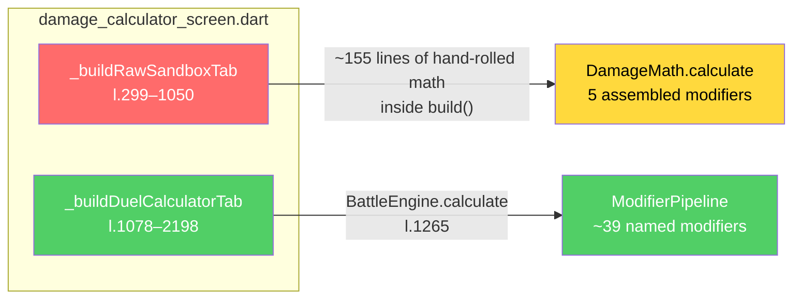

# LibreDex — Roadmap

**Owner:** @AlguemDaRua · **Last verified:** 2026-10-06 · **Against commit:** `0f63c88`
**Superseded audits:** [`docs/ARCHIVE.md`](docs/ARCHIVE.md) (frozen — read only for history)

This is the single living plan for LibreDex. Everything open lives here; everything
retired lives in the archive. If a number in this file disagrees with the code, the
code wins — re-run the commands in [§H](#h-measurement-appendix) and correct this file.

---

## 0. How to use this file

| Status | Meaning |
|:---:|---|
| ✅ | Shipped. Verified against the tree, with evidence in [§B](#b-completed). |
| 🔴 | **Critical path.** Start here; these five are ordered and each de-risks the next. |
| 🟡 | Next. Do not start before the critical path is closed. |
| 🔵 | Later. Real, deliberate, undated. |
| ⛔ | **Not doing.** Deferred *on purpose*, with the reason recorded. See [§F](#f-not-doing). |

**One rule:** an item is not ready to start until it has a **Done-when** that a
machine can check. An effort estimate without a Done-when is a wish.

**Two anti-patterns this file is designed to prevent:**

1. *Report accumulation.* The God Screens survived two full audit cycles carrying the
   same recommendation ("split them") without ever getting a first commit. That is the
   signature of a task too large to start, not of a task needing more detail. Every
   open item below is therefore scoped so its **first commit ships in under a day** —
   including the two large refactors, which are sequenced block-by-block rather than
   as single monolithic changes.
2. *Symptom-as-goal.* "227 `setState` calls" is not a defect — `setState` for a
   `TextEditingController` is correct. Do not let a count in this file become a target.

---

## A. Measurement basis

Measured at `0f63c88`. Re-derive with [§H](#h-measurement-appendix) before trusting.

| Metric | Value |
|---|---|
| Dart files in `lib/` | 118 |
| Lines in `lib/` | 46,349 |
| Of which generated (`.g.dart`) | 8,530 |
| Test files / lines | 18 / 3,612 |
| Test-to-source ratio | 1 : 12.8 |
| Feature modules | 13 |
| DB tables / explicit indexes | 5 / 17 (all created in `beforeOpen`) |
| Bundled JSON assets | 12 files, 5.8 MB (`pokemon_moves.json` alone = 2.9 MB) |
| God Screens | 3 files, 7,202 lines, **15.5 %** of `lib/` |

**Health signals**

| Signal | Count | Reading |
|---|---|:---|
| `Semantics` annotations | 7 | Serious a11y gap |
| `catch (_)` silent swallows | 24 | Serious |
| `setState` calls | 225 | Not inherently bad — see §0 |
| `late` fields | 117 | Moderate |
| `Color(0x…)` literals | 564 | Cosmetic / maintainability |
| `ValueKey` in list builders | 1 | Second-order perf |
| `RepaintBoundary` | 5 | Second-order perf |
| `precacheImage` | 0 | Second-order perf |
| `SelectionArea` | 0 | Real, cheap a11y win |
| `Navigator.push` | **11** | See [§G](#g-correction-log) |
| `ref.read` / `ref.watch` | 52 / 56 | Healthy — see §0 |
| View/widget files importing `app_database.dart` | 18 (34 repo-wide) | Layering drift |

---

## B. Completed

Verified present in the tree at `0f63c88`, not merely claimed by a prior report.

| ✅ | Item | Evidence |
|:---:|---|---|
| ✅ | Navigation redundancy removed | `app_drawer.dart` and `navigation_style_provider.dart` are gone |
| ✅ | Single source of truth for destinations | `AppSection` enum in `lib/core/navigation/app_sections.dart` |
| ✅ | Adaptive shell | `home_screen.dart:121` — `NavigationRail` ≥ 700 dp, `NavigationBar` below; `FeatureHubSheet` is the only overflow |
| ✅ | Champions rule accuracy (65 → 66 SP) | `ChampionsRules.totalStatPoints = 66`; asserted at `champions_ruleset_test.dart:143` |
| ✅ | Legends: Z-A — Mega Dimension | 49 Mega forms, IDs 10278–10326, confirmed in `forms_extra.json` |
| ✅ | Air Balloon immunity | Threaded through `combat_utils.dart:285` (grounding), `:828`, `:979` |
| ✅ | Regulation M-C held items | `champions_regulation_mc.json` — 151 items / 18 new |
| ✅ | **Test regression in `champions_regulation_test.dart`** | Already asserting `hasLength(151)` / `hasLength(18)` (lines 91–92). This was the #1 P0 of the previous plan; it is resolved. |
| ✅ | CI pipeline | Java 17 + Gradle cache, Flutter cache, Python 3.12, format gate, `analyze --fatal-infos`, 5 data validators, `flutter test --coverage`, debug APK |
| ✅ | Workflow protection | `.github/CODEOWNERS` requires @AlguemDaRua on `.github/**` |
| ✅ | **Two damage implementations unified** | Raw sandbox now resolves through `SandboxDamageEngine` → the shared `ModifierPipeline`. The hand-rolled ~155-line copy inside `_buildRawSandboxTab` is gone. |
| ✅ | Sandbox gains the mechanics it was missing | Aurora Veil, Multiscale/Shadow Shield, Filter/Solid Rock/Prism Armor, Ice Scales/Thick Fat/Purifying Salt, Tinted Lens, Expert Belt, Muscle Band/Wise Glasses, Life Orb and type gems, Weather Ball/Terrain Pulse, Technician/Sharpness/Iron Fist and friends |
| ✅ | Sandbox/duel parity test | `test/sandbox_damage_parity_test.dart` — identical rolls across a weather × terrain × screen × crit matrix plus items/abilities/doubles |
| ✅ | Index-creation hazard guarded | `app_database.dart` `beforeOpen` carries a do-not-move warning |
| ✅ | Ability-compatibility search debounced | `pokedex_screen.dart` uses the existing `DebouncedQuery` |
| ✅ | **Release signing configured** | `build.gradle.kts` signs from `android/key.properties` when present. **Action needed: create `key.properties` + keystore (git-ignored) before distributing.** |

---

## C. Critical path

**Status at 2026-10-06:** all five closed. C3 closed *without* measurement
because the app owner reports the Pokédex is smooth while typing — there is no
performance problem to chase. The real bug in that area turned out to be search
**responsiveness and ranking**, now tracked as D0.

| # | Item | Status | Note |
|:---:|---|:---:|---|
| C1 | Unify the two damage paths | ✅ | Second implementation deleted; parity test added |
| C2 | Index-creation hazard guard | ✅ | Warning comment in `beforeOpen` |
| C3 | Instrument before optimising | ✅ | **Closed — no perf problem exists.** Owner confirms the app is smooth while typing. The premise (a slow filter) was inherited from the v1 audit and was never verified. No perf work planned.
| C4 | Debounce the undebounced field | ✅ | Scope corrected — see [§G](#g-correction-log) |
| C5 | Release signing | ✅ | Config lands **unsigned-ready**; needs your `key.properties` |

Ordered. Each item de-risks the next. Do not reorder.

### ✅ C1 — Unify the two damage paths in the calculator

**Why:** This is the most serious defect in the codebase and it is not a size problem.
`damage_calculator_screen.dart` contains **two different damage calculators that
disagree**, and the plan that catalogued this file as a "God Screen" did not see it.



The engine path handles Aurora Veil (with screen mutual-exclusion), Multiscale, Shadow
Shield, Filter, Solid Rock, Prism Armor, Fluffy, Ice Scales, Puppeteer, Tinted Lens,
Expert Belt, and Weather Ball / Terrain Pulse type shifts. The sandbox path handles
**none** of them — it hardcodes `0.5` / `2732 / 4096` for screens and `1.5` for Sniper.

Two tabs, same screen, different answers, no way for a user to tell which to trust.

**Why it stayed invisible:** the >90 % engine-math coverage is real, but it tests the
*engine*. The sandbox math lives in a `build()` method, is unreachable without a widget
test, and has **zero** coverage.

**What:** Delete the parallel implementation. Make the Sandbox a thin preset that
constructs a `BattleState` and calls `BattleEngine.calculate`, exactly as the Duel tab
and `DamageCalculatorViewModel.calculate()` (l.356) already do.

**This is not the "split into 8 files" task.** That task relocates the duplicated math
into a tidy new file and cements it. Deleting it is a smaller change and a better one,
and it removes roughly 500 lines without anyone deciding where to put anything.

- **Done-when:** one test runs both tabs over a matrix of field conditions (weather ×
  terrain × screens × abilities × items) and asserts identical results;
  `grep -c "DamageMath.calculate" lib/features/calculator/views/damage_calculator_screen.dart`
  returns `0`.
- **Effort:** ~1 day. **Risk:** medium — needs care around the sandbox's free-form
  inputs (manual BP / Atk / Def / STAB / effectiveness) which the engine expects as a
  Pokémon; plan to express them as a synthetic `BattleState`.
- **Do this before any decomposition of this file.**

---

### ✅ C2 — Guard the index-creation hazard (5 minutes)

**Why:** A prior recommendation ("move the 17 `CREATE INDEX` statements from
`beforeOpen` to `onUpgrade`") would cause a silent, permanent, CI-invisible regression.
**`onUpgrade` does not run on fresh installs.** Ship that change literally and every new
user gets a database with no indexes at all — on the tables those 17 indexes were
designed for.

**What:** Leave the statements in `beforeOpen` (`app_database.dart:182–232`) and add a
comment at the block stating that they must be duplicated into `onCreate` **and**
`onUpgrade` if they are ever moved, never into `onUpgrade` alone.

- **Done-when:** the comment is present and a reviewer can see it without opening git
  history.
- **Effort:** 5 min. **Risk:** none.

---

### ⏸ C3 — Instrument before optimising

**Why:** The previous performance section proposed `ValueKey`s, `RepaintBoundary`, and
`precacheImage`. All real, all second-order. The actual data path is:

```
pokedexProvider  →  db.select(db.pokemonTable).watch()
                       ↑ unfiltered, unordered, 1,351 rows
   → build() → _getFilteredList()  →  145 lines of in-Dart predicate,
                                       re-run on every stream emission
```

The stream is the unit of invalidation, not the row: any write to `pokemon_table`
re-emits all 1,351 rows, which re-runs the filter, which rebuilds the grid. `ValueKey`
does not help when every element is being handed new data anyway.

**Status: blocked on a device or emulator run.** This is the one critical-path item
that cannot be closed from a static read of the code, and the agent session that
opened it had no Flutter toolchain or device available. The harness is below so it is
a 30-minute job rather than a re-derivation.

**What to measure** (release build, low-end Android device, Pokédex tab open):

1. Stream emissions per second while idle, and per debounced keystroke — add a
   temporary `print` in the `pokedexProvider` stream builder.
2. `_getFilteredList` wall time at 1,351 rows — wrap it in `Stopwatch` and log on
   every pass.
3. Frame times while typing — `flutter run --profile`, then the DevTools
   performance overlay, recording the worst frame over a 20-character query.
4. Whether the stream re-emits when unrelated tables are written (favourites, team
   slots). If it does, `watchAllPokemon` needs narrowing regardless of the filter.

- **Done-when:** the four numbers are recorded in this file, and the chosen fix
  (debounce vs. SQL pushdown vs. stream narrowing vs. `select` projection) is written
  into D1 with the measurement that justifies it.
- **Effort:** ~30 min on device. **Risk:** none.
- **Do not** start D1 on the assumption that debouncing is the answer — C4 already
  showed that assumption wrong once.

---


### ✅ C4 — Debounce the one search field that was not

**Why:** All four dex screens route their main search through `DexFilterBar`, which
already wraps `DebouncedSearchField` at 300 ms. The *previous version of this plan
claimed otherwise* — see [§G](#g-correction-log); the error was inferring from a
direct grep for `DebouncedSearchField` and missing the indirect use.

What is genuinely undebounced is narrower and worse: the **ability-compatibility
search inside the Pokédex advanced-filter sheet**
(`pokedex_screen.dart`, "FILTER BY ABILITY COMPATIBILITY"). Each keystroke called
`setState`, and `_getFilteredList` then rescanned all 1,351 Pokémon, iterating each
one's ability list and running `contains()` against both the ability **name and its
full description text** — the most expensive per-keystroke path in the app.

**Done:** that field now routes through the existing `DebouncedQuery` primitive. The
sheet's own refresh stays immediate so typing still feels responsive; the expensive
full-list refilter waits for the pause.

- **Done-when:** ✅ `_abilityQueryDebounce` gates `_filterAbilityQuery`; typing no
  longer triggers a filter pass per character.
- **Effort:** ~20 min. **Risk:** low — the debounced callback is `mounted`-guarded.

---


### ✅ C5 — Release signing configuration

**Why:** `android/app/build.gradle.kts:36` sets release builds to
`signingConfigs.debug`. The app cannot be distributed as-is. This is the only item
carried over unchanged from the previous plan's critical phase, and it is still
genuinely critical and genuinely cheap.

- **Done-when:** `flutter build apk --release` produces a signed APK from a
  git-ignored keystore referenced by `key.properties`; CI can build release without
  secrets in the tree.
- **Effort:** ~1 h. **Risk:** low (but irreversible if the keystore is lost — back it up).
- **Status:** the *configuration* is done and the tree still builds without a
  keystore (it falls back to the debug key and logs a warning, so CI is unaffected).
  The **keystore itself is not and must never be committed** — create
  `android/key.properties` locally before the first real release.

---

## D. Next

Do not start these until C1–C5 are closed. Each gets a Done-when before it starts.

### ✅ D2 — Species categories: delete the hardcoded lists, fix the data

**Done 2026-10-06.** The premise was wrong in a helpful way. The owner
suggested the hardcoded lists existed because the API has no way to tell
Ultra Beasts and Paradox Pokémon apart. Half right:

- `isLegendary` / `isMythical` **do** come from PokéAPI
  (`pokemon_species.csv` → `is_legendary` / `is_mythical`).
- `isParadox` / `isUltraBeast` are **not modelled by PokéAPI at all**. They
  exist only in the bundled `assets/data/pokemon.json` snapshot, which is a
  checked-in file that overlay scripts patch in place — nothing regenerates
  it from scratch, so edits there are durable.

So the fix was not "move the lists to a data file"; it was **fix the data and
delete the lists**. All four helpers are now one-liners reading the model's
own flags (-130 lines from `pokedex_screen.dart`).

Diffing the hardcoded fallbacks against the data found real bugs:

| Category | Bug | Fix |
|---|---|---|
| Ultra Beast | fallback `dex >= 793 && dex <= 806` swept in **Necrozma, Magearna, Marshadow** — all three are Legendary/Mythical, not UBs | fallback deleted; data's 11 are correct |
| Paradox | data was missing **Roaring Moon, Iron Valiant, Gouging Fire, Raging Bolt, Iron Boulder, Iron Crown** | 6 rows set `isParadox: true` |
| Mythical | **Pecharunt** filed as Legendary; it is Mythical | `isLegendary: false`, `isMythical: true` |

Counts are now canonical: **71 Legendary / 23 Mythical / 22 Paradox / 11 Ultra
Beast**, with zero species disagreeing across their own forms.

### ✅ D3 — `_loadRelationsData` swallowed every failure

**Done 2026-10-06.** `_loadRelationsData()` pulled every ability and every
junction row into memory on each `initState`, wrapped in `catch (_) {}`. On
failure both maps stayed empty, so the ability filter rejected **every**
Pokémon — the grid showed "no results" and nothing said why. A silent wrong
answer, not a logging gap.

- Errors are now logged with a stack trace and held in `_relationsError`.
- The ability filter is gated on `_relationsLoaded`: if the data is missing the
  filter stands down instead of returning nothing.
- A warning strip with a **Retry** button shows when the load failed.

### ✅ D4 — Calculator picker: hide forms that cannot change a result

**Done 2026-10-06.** Owner's ask: the picker listed every Mimikyu (four
interchangeable entries) and they only want "versions that matter".

A form matters in a damage calculator iff it differs from its species' base
form in **base stats, typing, or abilities**. Ability had to be part of the
test: 10 forms have identical stats but a different ability, and those change
damage — Meowstic-Female (Prankster), Greninja-Battle-Bond (Battle Bond),
Rockruff-Own-Tempo, Zygarde-Power-Construct, Basculin-White-Striped,
Toxtricity-Low-Key, two Squawkabilly plumages.

Result: **82 cosmetic forms hidden**, 1302 rows → 1220. Mimikyu collapses
4 → 1. Megas, regional variants, Rotom and Aegislash-Blade are all retained.

Abilities are not on the `Pokemon` row, so `pokemonAbilityIdsProvider` loads
the bundled `assets/data/pokemon_abilities.json` once. Until it resolves the
picker shows everything rather than guessing — hiding a real form is worse
than briefly showing a cosmetic one.

### 🟡 D5 — Held items the dataset cannot currently express

**Open, needs a decision.** Four damage-relevant items are absent from
`held_items_data.dart`, and the current `HeldItem` model **cannot express any
of them**:

| Item | Real effect | Why the model can't do it |
|---|---|---|
| Expert Belt | ×1.2 **only on super-effective** hits | no effectiveness conditional |
| Muscle Band | ×1.1 **physical move power** | only has `atkMultiplier` (Attack *stat*); BP and Attack enter the formula at different points, so they are not interchangeable |
| Wise Glasses | ×1.1 **special move power** | same |
| Punching Glove | ×1.1 **punching** moves, removes contact | no move-flag awareness |

Adding them approximately would put **wrong numbers** into the component the
owner wants 100% correct, so they are deliberately not added until the model
gains the needed fields. Doing this properly means extending `HeldItem` and
wiring the new fields into `ModifierPipeline` at the right stage
(move-power vs final-modifier), then verifying against Showdown.

**Already fixed (2026-10-06):** two scenarios in
`sandbox_damage_parity_test.dart` named `Expert Belt` and `Muscle Band`, which
do not exist. `findByName` returns `null`, every multiplier fell back to 1.0,
and both engines trivially agreed — **2 of 12 scenarios passed while testing
nothing**. Both now name real items (`Choice Band` covers the stat path,
`Charcoal` covers the previously untested type-boost path and matches the
Fire-type Flare Blitz the test uses), and a `checkItem` guard throws on any
unknown name so this cannot silently recur.

### 🟡 D0 — Search: responsiveness and ranking (highest value, do first)

Two separate causes produced one symptom — "I have to type the whole Pokémon
name before anything appears". Both are fixed; the fix needs device confirmation.

1. **The list never updated while typing.** `DebouncedSearchField` used a pure
   300 ms *trailing* debounce: it cancelled the pending timer on every
   keystroke, so anyone typing faster than ~300 ms/character saw no update at
   all until they paused — usually after finishing the word. Replaced with a
   leading-edge throttle at 100 ms plus a guaranteed trailing emit, so results
   narrow from the first keystroke and the final value is never stranded.
   **This fixes every search in the app** — all four dex screens, the three
   calculator pickers and stat comparison share the widget.
2. **Real matches were buried by subsequence noise.** `gar` matched 64 species,
   48 of them by subsequence (Magikarp, Graveler, Terapias…). With no ranking
   and dex-order sorting, Garchomp sat behind dozens of junk rows. Added
   `_searchRank` (exact → name-prefix → word-prefix → substring → form → dex →
   type → tokens → everything-else); while searching on the default sort,
   relevance now takes precedence over dex order.

- **Done-when:** confirmed on device — results narrow as you type, and `gar`
  surfaces Gardevoir/Garchomp/Garbodor ahead of subsequence matches.
- **Follow-up if still not right:** drop subsequence matching entirely, or gate
  it behind "no substring matches found".

**Ordering rule (decided 2026-10-06):** results are ordered by match quality
first — exact → name-prefix → word-prefix → substring → form → dex → type →
token → subsequence — and **dex number within a quality tier**.

Dex order was kept deliberately over alphabetical after testing both. For
`char`, dex gives Charmander, Charmeleon, Charizard (the evolution line stays
adjacent); alphabetical gives Charcadet, Charizard, Charjabug, Charmander,
Charmeleon. Dex is also the canonical Pokédex order.

Consequence worth knowing: for `gar`, **Gardevoir, Garchomp, Garbodor and
Garganacl are all equally good prefix matches**, so Garchomp can legitimately
be 2nd. No ordering rule can infer which one the user was thinking of — this
is not hardcoding and not a bug.

**Product decision (owner, 2026-10-06):** the Pokédex shows **one card per
species, base form only** — no variants in the listing. Forms are reached from
the Pokémon's own detail page. Implemented: the card now picks
`form == 'normal'` explicitly (all 1025 species groups have one) instead of
relying on `group.first` happening to be the base, and the `"N forms"` badge is
gone. `PokemonDetailScreen(forms: group)` is unchanged, so every form is still
one tap away.


| # | Item | Why it matters | Target | Est. |
|:---:|---|---|---|:---:|
| D1 | **Decompose `pokedex_screen.dart` — the 826-line bottom sheet first** | The previous split targeted `filter chips` / `sort controls` / `grid card` and **never mentioned `_openAdvancedFilterBottomSheet` (l.1189–2015)** — the single largest block in the file. Its four target files summed to ~1,150 of 2,287 lines, so the worst 40 % had nowhere to go. | `pokedex_screen.dart` | 1–2 d |
| D2 | **Move classification ID sets to data** | `_isLegendary` / `_isMythical` / `_isParadox` / `_isUltraBeast` (l.147–285) hardcode ~130 lines of National-Dex IDs and name prefixes in Dart. This is data wearing a code costume; it belongs in `assets/data/`, versioned alongside the other 12 JSON files. | `pokedex_screen.dart`, `assets/data/` | 3 h |
| D3 | **Replace the in-memory relation maps** | `_loadRelationsData()` (l.109) pulls all 367 abilities **and every row of `pokemon_abilities_table`** into two `Map`s on every `initState`, to power one filter. It is wrapped in `catch (_) {}` — if it fails, the hidden-ability filter silently returns zero results. Fix the design (`JOIN` in SQL), not just the logging. | `pokedex_screen.dart` | 3 h |
| D4 | **Feature repositories for the 18 view/widget files** | 18 files under `views/`/`widgets/` import `app_database.dart`; several run real queries (`abilitydex_screen.dart:80`, `calculator/views/damage_calculator_screen.dart:97,124`, `move_detail_screen.dart:100`). Note the distinction: importing a Drift *data class* for typing is fine; running `db.select()` in a widget is not. | `abilitydex`, `movedex`, `itemdex`, `stat_comparison`, `calculator` | 1 d |
| D5 | **Accessibility baseline** | 7 `Semantics` in 46k lines. Start where it is cheapest and highest-traffic: `TypePill`, `StatTile`, `PokemonGridCard`, type-chart matrix cells. Add `SelectionArea` around `MaterialApp.builder` (15 min, whole-app win). | `core/widgets/`, `main.dart` | 4 h |
| D6 | **Silent-failure audit** | 24 `catch (_)`. Triage by blast radius, not by count — D3 above is one of them and is a user-visible wrong-answer bug, not a logging gap. Add `FlutterError.onError` + `ErrorWidget.builder` in `main.dart`. | 12 files | 3 h |
| D7 | **ViewModel unit tests** | `DamageCalculatorViewModel`, `PokedexViewModel`, `StatsCalculatorViewModel`, `StatComparisonViewModel`. Scheduled here — *after* C1 — deliberately: restructuring without tests is how the duplication in C1 survived. | `test/viewmodels/` | 1 d |
| D8 | **Release-readiness hygiene** | Gradle JVM args `-Xmx8G -XX:MaxMetaspaceSize=4G` → `-Xmx4G -XX:MaxMetaspaceSize=1G` (OOMs on CI runners); `proguard-rules.pro` for Drift/SQLite3/Dio; `network_security_config.xml`. | `android/` | 2 h |

---

## E. Later

Real work, deliberately undated. Pull one in when the critical path and D-block are
green — not before.

| # | Item | Note |
|:---:|---|---|
| E1 | `go_router` / declarative routing | Only if deep linking becomes a product requirement. See [§F](#f-not-doing). |
| E2 | SQLite FTS5 search | Only after search moves into SQL. There are currently **zero** `LIKE` queries in the codebase — search is `_isSubsequence()` over an in-memory list. FTS5 today would index a query pattern that does not exist. |
| E3 | Localisation (i18n / ARB) | Large, mechanical, and much easier once D-block settles the UI structure. |
| E4 | iOS support | `Icons/ios/` (22 files) and `Icons/web/` are **already staged** in the repo for this. |
| E5 | Golden / visual regression tests | Needs a stable UI first — E5 after D1. |
| E6 | `OfflineArtworkStore` → Riverpod provider | Currently `OfflineArtworkStore.instance` (static) with a manual `_persistQueue` chain. Worth doing when it needs to be mockable in a test. |
| E7 | Design tokens — extract 564 `Color(0x…)` literals into `AppTheme` semantics | Cosmetic; do it opportunistically file-by-file rather than as a campaign. |
| E8 | Integration test (`integration_test/app_flow_test.dart`) | Highest-value test investment after D7. |
| E9 | Binary asset compression (`pokemon_moves.json`, 2.9 MB) | Prefer `--split-per-abi` + App Bundle first; measure before adding CBOR complexity to the seed path. |

---

## F. Not doing

Explicitly deferred, with reasons, so these stop regenerating every audit cycle.
Revisit an entry when its *revisit condition* becomes true — not because it is old.

| ⛔ | Item | Why not now | Revisit when |
|:---:|---|---|---|
| ⛔ | **`go_router` migration** (was: "replace 82 `Navigator.push` calls") | There are **11** pushes, not 82. This is an `IndexedStack` app with a bespoke, *already-tested* `SectionBackStack` (`section_back_stack_test.dart`). go_router buys deep links for a URL scheme that has not been designed, and costs a working back-stack abstraction. | A URL scheme or deep-link requirement exists |
| ⛔ | **Move index creation to `onUpgrade`** | Would leave fresh installs with no indexes. See C2. | Never as written — only with `onCreate` **and** `onUpgrade` |
| ⛔ | **SQLite FTS5** | No `LIKE` queries exist; search is in-Dart. | Search moves into SQL (see C3) |
| ⛔ | **ApiClient retry / connectivity / rate limiting** | `ApiClient` has **2 call sites** (`pokemon_repository.dart:226,231`), both for evolution chains, both with a bundled fallback. Three dependencies to guard one optional request. | A second, non-optional network feature appears |
| ⛔ | **Coverage gate (`--min-coverage 60`)** | At ~12 % coverage this is a gate that goes red on day one and gets ignored by day five. A red light everyone ignores is worse than no light. | Coverage is within ~10 pts of the threshold |
| ⛔ | **Blanket `setState` → Riverpod migration** | 225 `setState` calls are mostly correct usage (text controllers, expansion state, animation). Migrating them is churn with regression risk and no user-visible gain. | A specific `setState` is shown to be causing a bug |
| ⛔ | **Blanket `ref.read` → `ref.watch`** | 52 / 56 is a healthy ratio; `ref.read` in callbacks is the *recommended* pattern. Only `ref.read` inside `build()` is a bug, and there are few of those. | — |
| ⛔ | **Removing all cross-feature imports** | Some are legitimate shared-model sharing (`stat_comparison` → `calculator` for `ChampionsRules`). The ones worth fixing are the *cycles*: `pokedex ↔ movedex`, `pokedex ↔ abilitydex`. | Part of D4, scoped to cycles only |
| ⛔ | **Web / desktop targets** | Android is the only shipped platform. | Android + iOS are stable |

---

## G. Correction log

Errors found in the previous plan (now [archived](docs/ARCHIVE.md)) by verifying it
line-by-line against the tree. Recorded so nobody re-derives them.

| Claim in v1 | Actual | Consequence |
|---|---|---|
| "Active test regression: expects 140/7, actual 151/18" | Test already asserts `151` / `18` | The #1 P0 item was already resolved; starting there wastes a cycle |
| "82 imperative `Navigator.push` calls" | **11** pushes (73 `Navigator` refs, mostly `pop` in dialogs) | Inflated the go_router business case ~7× |
| "10 UI view/widget files import `app_database.dart`" | **18** (34 repo-wide) | Understated the layering work by ~80 % |
| "Move index creation from `beforeOpen` to `onUpgrade`" | Would break fresh installs | Would ship a silent, permanent, CI-invisible regression |
| "3 God Screens = 7,136 lines / 15.6 %" | 7,202 lines / 15.5 % (line drift) | Cosmetic |
| "227 `setState` · 131 `late` · 467 `Color()`" | 225 · 117 · 564 | Cosmetic |
| Pokedex split targets | ~1,150 of 2,287 lines; omits the 826-line bottom sheet | Would leave the worst 40 % of the file untouched |
| Calculator split into 8 panels | File is **2** mega-methods, organised by tab, not 8 panels | A contributor cannot find the proposed seams |
| "Debounce AbilityDex and ItemDex" | `DebouncedSearchField` already exists; Pokédex (largest list) was excluded | Wrong priority; infrastructure existed |
| `battle_ruleset.dart` under `battle_engine` | It lives in `features/calculator/models/` | Minor path error |
| — | **Two divergent damage implementations in one screen** | Missed entirely; now C1 |
| **v2:** "Pokédex/MoveDex/AbilityDex/ItemDex search is not debounced" | All four already debounce at 300 ms via `DexFilterBar` → `DebouncedSearchField` | Wrong target. C4 was re-scoped to the one field that genuinely was not. Recorded here because the error came from inferring behaviour from a direct grep and missing an indirect call. |
| **v2:** "Swap the four raw `TextField`s for `DebouncedSearchField`" | There were no raw search `TextField`s to swap | Task was already complete |
| **v1 (Claude Opus 4.6):** "Synchronous main-thread filtering… 900+ items filtered on every character typed", "cold-start", energy/frame budgets — the whole §6 performance audit | Owner confirms **nothing feels laggy**. No measurement ever backed it. | An entire section of the audit was fabricated from code-reading. Cost: C3 existed to chase a problem that does not exist. **Lesson: any performance claim in this file must cite a measurement or be labelled a hypothesis.** |
| **v1:** `DebouncedSearchField` debounce set to 300 ms | A trailing debounce that long means the callback never fires while a normal-speed typist is typing | Caused the exact bug the owner reported; fixed under D0 |


---

## H. Measurement appendix

Re-run these from the repository root to re-derive [§A](#a-measurement-basis).

```bash
# Size
find lib -name "*.dart" | wc -l                     # files
find lib -name "*.dart" -exec cat {} + | wc -l      # lines
find lib -name "*.g.dart" -exec cat {} + | wc -l    # generated lines
find lib -name "*.dart" -exec wc -l {} + | sort -rn | head -15

# Tests
find test -name "*.dart" | wc -l
find test -name "*.dart" -exec cat {} + | wc -l

# Health signals
grep -rc "Semantics("        lib --include=*.dart | awk -F: '{s+=$2} END {print s}'
grep -rEo "catch\s*(_"       lib --include=*.dart | wc -l
grep -rEo "setState\("       lib --include=*.dart | wc -l
grep -rEo "\blate\b"         lib --include=*.dart | wc -l
grep -rEo "Color\(0x[0-9A-Fa-f]{8}\)" lib --include=*.dart | wc -l
grep -rc "ValueKey"          lib --include=*.dart | awk -F: '{s+=$2} END {print s}'
grep -rc "RepaintBoundary"   lib --include=*.dart | awk -F: '{s+=$2} END {print s}'
grep -rc "precacheImage"     lib --include=*.dart | awk -F: '{s+=$2} END {print s}'

# The number that was 7x wrong
grep -rEo "Navigator\.push[A-Za-z]*\(" lib --include=*.dart | wc -l   # pushes
grep -rEo "Navigator\.[a-zA-Z]+"       lib --include=*.dart | wc -l   # all refs

# Layering
grep -rln "app_database.dart" lib/features --include=*.dart | grep -E "/(views|widgets)/" | wc -l
grep -rEo "ref\.(read|watch)\(" lib --include=*.dart | sort | uniq -c

# Cross-feature import pairs (cycles are the ones that matter)
for f in $(find lib/features -name "*.dart" ! -name "*.g.dart"); do
  feat=$(echo "$f" | cut -d/ -f3)
  grep -oE "package:libredex/features/[a-z_]+/" "$f" \
    | sed 's|package:libredex/features/||;s|/||' | sort -u \
    | while read -r t; do [ "$t" != "$feat" ] && echo "$feat -> $t"; done
done | sort | uniq -c | sort -rn

# C1 verification
grep -c "DamageMath.calculate" lib/features/calculator/views/damage_calculator_screen.dart
grep -c "BattleEngine.calculate" lib/features/calculator/views/damage_calculator_screen.dart

# Data assets
ls -la assets/data | tail -n +2 | awk '{s+=$5} END {print s/1048576 " MB"}'
python3 -c "import json;d=json.load(open('assets/data/champions_regulation_mc.json'));print(len(d['itemIds']),len(d['newItemIds']))"
```

---

## I. Standing notes

Things that are true, are not tasks, and will otherwise be rediscovered painfully.

- **The three God Screens are a symptom, not a goal.** Splitting a file is worth doing
  only when it makes a specific change easier. C1 removes ~500 lines by *deleting*
  duplicated logic; that is better than moving it.
- **`Icons/` holds pre-staged platform icons.** `Icons/ios/` (22 files) and
  `Icons/web/` exist ahead of those platforms. `Icons/android/` was a byte-identical
  duplicate of `android/app/src/main/res/mipmap-*` and has been removed.
- **Two test files are misnamed, not junk.** `widget_test.dart` is actually a
  PokedexScreen + `FormFacts` + `CombatUtils` + `GenderRatio` + `SpriteQuality` suite,
  and `complete_improvement_plan_test.dart` covers move properties, ability tags and
  Pokémon classification. Both are real coverage behind plan-artifact names; rename
  them when next touching either file.
- **The Pokédex `stream → filter → rebuild` path is the app's performance centre of
  gravity.** Optimisations anywhere else are unlikely to be felt. Measure first (C3).
- **`.metadata` and `.vscode/settings.json` are intentionally tracked.** Flutter
  documents `.metadata` as version-controlled; the VS Code setting affects Gradle
  build-configuration prompts. Neither is stray.
