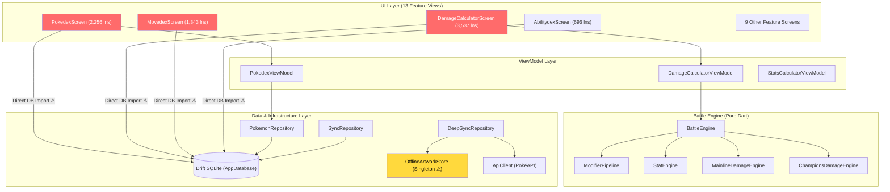
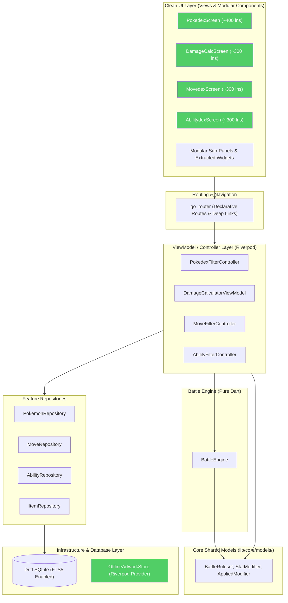

# LibreDex — Master Architecture, Refactoring & Rebuild Plan
### October 2026 · 118 Source Files · 45,721 Lines · 13 Feature Modules

This document contains the complete, exhaustive deep analysis and actionable step-by-step master plan to make **LibreDex** 10,000x perfect. It builds upon the August 2026 audit, documents all progress made, cataloging every remaining issue, code smell, architectural bottleneck, performance degradation, accessibility gap, CI/CD and test regression, and security concern, and provides a prioritized execution roadmap.

---

## Table of Contents
1. [Executive Overview & Progress Tracking](#1-executive-overview--progress-tracking)
2. [Codebase Footprint & Metrics](#2-codebase-footprint--metrics)
3. [Architecture Deep Dive & Layering Violations](#3-architecture-deep-dive--layering-violations)
4. [The "God Screens" Decomposition Plan](#4-the-god-screens-decomposition-plan)
5. [State Management Audit & Consistency Strategy](#5-state-management-audit--consistency-strategy)
6. [Performance & Energy Efficiency Audit](#6-performance--energy-efficiency-audit)
7. [Database Schema & Data Pipeline Analysis](#7-database-schema--data-pipeline-analysis)
8. [Network Layer & Offline-First Resiliency](#8-network-layer--offline-first-resiliency)
9. [Comprehensive Testing Gap Analysis & Active Test Regression](#9-comprehensive-testing-gap-analysis--active-test-regression)
10. [CI/CD Pipeline, Security & Build Configuration](#10-cicd-pipeline-security--build-configuration)
11. [Data Pipeline & Generation Tooling (`tools/`)](#11-data-pipeline--generation-tooling-tools)
12. [Accessibility (a11y) Audit & Action Plan](#12-accessibility-a11y-audit--action-plan)
13. [Security, Build & Android Configuration](#13-security-build--android-configuration)
14. [Error Handling & Silent Failure Audit](#14-error-handling--silent-failure-audit)
15. [UI/UX Polish, Design Tokens & Magic Numbers](#15-uiux-polish-design-tokens--magic-numbers)
16. [Store Metadata, Distribution & Legal Compliance](#16-store-metadata-distribution--legal-compliance)
17. [Code Hygiene, Lints & Static Analysis](#17-code-hygiene-lints--static-analysis)
18. [Multi-Platform & Scalability Strategy](#18-multi-platform--scalability-strategy)
19. [Green Software & Sustainability (Eco-Path)](#19-green-software--sustainability-eco-path)
20. [Master 40-Item Prioritized Execution Checklist](#20-master-40-item-prioritized-execution-checklist)

---

## 1. Executive Overview & Progress Tracking

LibreDex is a feature-packed, offline-first Pokémon reference and competitive team-planning app built with Flutter and Riverpod. 

### Progress Made Since August 2026
- ✅ **Navigation Redundancy Resolved**: Deleted `navigation_style_provider.dart` and `app_drawer.dart`. Implemented a clean adaptive shell in `HomeScreen` switching between a bottom `NavigationBar` (<700dp) and `NavigationRail` (≥700dp), using `FeatureHubSheet` as the single overflow.
- ✅ **Single Source of Truth Navigation**: Replaced raw integer index mappings with the `AppSection` enum in `app_sections.dart`.
- ✅ **Champions Rule Accuracy**: Updated `totalStatPoints` to **66 SP** across `battle_ruleset.dart`, stat calculators, UI cards, and tests.
- ✅ **Legends: Z-A Mega Dimension DLC**: Verified 49 Mega Evolutions in `assets/data/forms_extra.json` (IDs `10278–10326`).
- ✅ **Air Balloon & Regulation M-C Held Items**: Threaded Air Balloon immunity into `ModifierPipeline` and damage calculation.

### Outstanding Challenges
- ❌ **3 Massive God Screens**: 7,136 lines (15.6% of the codebase) remain in `damage_calculator_screen.dart`, `pokedex_screen.dart`, and `movedex_screen.dart`.
- ❌ **Active Test Regression in CI**: `test/champions_regulation_test.dart` has outdated item assertions (expected 140/7 items, actual is 151/18 items per commit `217f7a6`), breaking the test suite and PR #12 CI check.
- ❌ **Direct Database Access**: 10 UI view/widget files directly import `app_database.dart`, bypassing the repository layer.
- ❌ **Accessibility Blind Spot**: Only 7 `Semantics` annotations across 45,721 lines of code.
- ❌ **UI Test Deficit**: Engine math tests have >90% coverage, but UI coverage is <15% with zero integration tests.

---

## 2. Codebase Footprint & Metrics

- **Total Source Files (`lib/`)**: 118 files
- **Total Lines of Code (`lib/`)**: 45,721 lines
- **Total Test Files (`test/`)**: 18 files (3,612 lines)
- **Test-to-Source Code Ratio**: 1:12.7 (Target: 1:4)
- **Generated Lines (`.g.dart`)**: 8,829 lines
- **Database Tables**: 5 main tables (Pokemon, Move, Ability, PokemonMoves, PokemonAbilities)
- **Database Indexes**: 17 explicit indexes
- **Bundled Data Assets**: 12 JSON files (5.8MB total)
- **Data Tooling Scripts**: 20 scripts in `tools/`

### Top 15 Largest Files in `lib/`

| # | File Path | Line Count | Primary Role |
|:---:|---|:---:|---|
| 1 | `lib/core/database/app_database.g.dart` | 7,857 | Generated Drift Code |
| 2 | `lib/features/calculator/views/damage_calculator_screen.dart` | 3,537 | **God Screen** (Calculator UI + State) |
| 3 | `lib/features/pokedex/views/pokedex_screen.dart` | 2,256 | **God Screen** (Pokédex List + Filters) |
| 4 | `lib/features/movedex/views/movedex_screen.dart` | 1,343 | **God Screen** (MoveDex UI + Local State) |
| 5 | `lib/features/movedex/views/move_detail_screen.dart` | 1,321 | Move Detail View |
| 6 | `lib/features/pokedex/widgets/pokemon_detail_general_tab.dart` | 1,255 | Monolithic Detail Tab |
| 7 | `lib/features/itemdex/views/itemdex_screen.dart` | 1,244 | ItemDex List + Local Filtering |
| 8 | `lib/features/abilitydex/views/ability_detail_screen.dart` | 1,231 | Ability Detail View |
| 9 | `lib/features/settings/views/settings_screen.dart` | 1,070 | Settings UI & Operations |
| 10 | `lib/features/calculator/utils/combat_utils.dart` | 1,064 | Combat Utilities & Gimmicks |
| 11 | `lib/features/team_builder/views/team_builder_screen.dart` | 976 | Team Builder UI |
| 12 | `lib/features/typechart/views/typechart_screen.dart` | 913 | Type Chart Matrix View |
| 13 | `lib/features/pokedex/widgets/pokemon_detail_stats_tab.dart` | 817 | Stats Tab View |
| 14 | `lib/features/battle_engine/services/modifier_pipeline.dart` | 793 | Damage Modifier Engine |
| 15 | `lib/features/stat_comparison/models/stat_modifier.dart` | 743 | Stat Comparison Model |

---

## 3. Architecture Deep Dive & Layering Violations

### Current System Architecture



### Architectural Findings & Bottlenecks

1. **`battle_engine` Layering Gold**: `lib/features/battle_engine` is pure Dart with zero Flutter dependencies. It uses clean immutable state (`BattleState`, `PokemonState`, `FieldState`) and explicit pipeline services (`ModifierPipeline`, `StatEngine`).
2. **Cross-Feature Import Violations**:
   - `battle_engine` imports from `calculator`, `pokedex`, and `stat_comparison` (12 imports).
   - `calculator` imports from `battle_engine` and `pokedex` (8 imports).
   - `abilitydex` imports from `pokedex` (3 imports).
   - *Fix*: Move all shared models (e.g., `BattleRuleset`, `StatModifier`) into `lib/core/models/`.
3. **Direct DB Imports in UI Layer**: 10 UI files directly import `app_database.dart`.
   - *Fix*: Introduce proper feature repositories (`AbilityRepository`, `MoveRepository`, `ItemRepository`, `StatComparisonRepository`) to encapsulate database queries.

---

## 4. The "God Screens" Decomposition Plan

### 4.1 `damage_calculator_screen.dart` (3,537 lines) → 8 Target Files

Split the massive single file into dedicated, maintainable components:

```
lib/features/calculator/
├── views/
│   ├── damage_calculator_screen.dart   (~300 lns — main scaffold & tabs)
│   ├── attacker_panel.dart             (~450 lns — attacker selection & EVs/IVs)
│   ├── defender_panel.dart             (~450 lns — defender selection & EVs/IVs)
│   ├── result_summary_panel.dart       (~350 lns — damage rolls & KO chance)
│   ├── field_conditions_panel.dart     (~250 lns — weather, terrain, screens)
│   └── stat_point_editor.dart          (~300 lns — Champions 66 SP sliders)
└── widgets/
    ├── calculator_helpers.dart         (existing, retain)
    └── ev_slider_group.dart            (~200 lns — extracted EV/IV slider control)
```

### 4.2 `pokedex_screen.dart` (2,256 lines) → 5 Target Files

```
lib/features/pokedex/
├── viewmodels/
│   └── pokedex_filter_controller.dart  (~350 lns — handles all 20+ filter states)
├── views/
│   └── pokedex_screen.dart             (~400 lns — search bar & grid scaffold)
└── widgets/
    ├── pokedex_filter_chips.dart       (~250 lns — active filter summary & pills)
    ├── pokedex_sort_controls.dart      (~150 lns — sort dropdown & order toggles)
    └── pokemon_grid_card.dart          (existing, retain)
```

### 4.3 `movedex_screen.dart` & `abilitydex_screen.dart`

- Extract UI state from `StatefulWidget` into `MoveFilterController` and `AbilityFilterController` Riverpod notifiers.
- Offload filtering from `setState` to SQL queries in Drift.

---

## 5. State Management Audit & Consistency Strategy

### State Management Landscape
- **Riverpod Codegen (`@riverpod`)**: 10 providers (Database, Theme, Navigation, Calculator)
- **Manual Riverpod (`Provider` / `Notifier`)**: 25 providers (Sync, Repositories, Favorites)
- **`setState` Calls**: **227 instances** across 13 features

### Issues & Remediation Plan

1. **Convert Singleton `OfflineArtworkStore` to Riverpod**:
   - `OfflineArtworkStore.instance` is accessed statically across `PokemonSprite` and `ItemArtworkIcon`.
   - *Fix*: Wrap it in `@Riverpod(keepAlive: true)` to allow mocking in unit/widget tests.
2. **Eliminate Cold-Start Theme Flash**:
   - `theme_provider.dart` and `navigation_provider.dart` synchronously initialize to defaults before `SharedPreferences` finishes reading.
   - *Fix*: Async pre-load `SharedPreferences` in `main()` before calling `runApp()`.
3. **Refactor UI `ref.read` in Build Methods**:
   - 53 calls to `ref.read` vs 54 calls to `ref.watch`. Audit and replace any `ref.read` calls inside `Widget build()` with `ref.watch` to ensure reactive rebuilding.

---

## 6. Performance & Energy Efficiency Audit

1. **Missing Widget Keys**: Only 1 `ValueKey` and 1 `GlobalKey` exist in `lib/`. `ListView.builder` items in Dex screens lack keys, causing Flutter to rebuild entire lists rather than reordering elements during sort/filter changes.
2. **Missing `AutomaticKeepAliveClientMixin`**: Tab switching in `PokemonDetailScreen` forces tab children to rebuild from scratch on every swipe.
3. **Synchronous Main-Thread Filtering**: `AbilityDex` and `ItemDex` filter 900+ items inside `setState` on every character typed without input debouncing.
4. **Repaint Boundaries**: Only 5 `RepaintBoundary` instances exist. Heavy visual components (Type Chart matrix, Damage Calculator results card) rebuild parent contexts unnecessarily.
5. **Image Precaching**: Zero `precacheImage` calls exist. Grid taps experience visual delay when opening high-res Pokémon artwork.

---

## 7. Database Schema & Data Pipeline Analysis

### Schema Design (`lib/core/database/app_database.dart`)
- **Schema Version**: 5 (with migrations handling v1→v5).
- **Tables**: `PokemonTable`, `MoveTable`, `AbilityTable`, `PokemonMovesTable`, `PokemonAbilitiesTable`.
- **Indexes**: 17 custom SQL indexes.

### Database Improvements
1. **Move Index Creation to `onUpgrade`**: 17 `CREATE INDEX IF NOT EXISTS` statements currently execute inside `beforeOpen` on every single app cold start. Move them to `onUpgrade`.
2. **FTS5 Full-Text Search**: Implement SQLite FTS5 virtual tables for Pokémon and move names to eliminate costly `LIKE '%query%'` linear scans.
3. **Strongly-Typed Stream Returns**: `watchPokemonAbilities` and `watchPokemonMoves` currently return `Stream<List<Map<String, dynamic>>>`. Refactor to return typed data wrappers (`PokemonAbilityWithDetails`, `PokemonMoveWithDetails`).

---

## 8. Network Layer & Offline-First Resiliency

1. **`ApiClient` Enhancement**: Expand the 22-line `ApiClient` Dio wrapper to include retry policies (`dio_smart_retry`), network connectivity pre-checks (`connectivity_plus`), and rate limiting.
2. **Offline Artwork Store Concurrency Protection**: `OfflineArtworkStore` uses a manual `_persistQueue` future chain for JSON manifest writes. Add explicit mutex locking during batched concurrent image downloads to prevent manifest corruption.

---

## 9. Comprehensive Testing Gap Analysis & Active Test Regression

### 9.1 Active Test Regression (Root Cause Identified)

The test suite currently fails with:
```
Failing tests:
  test/champions_regulation_test.dart: M-C move, ability and item pools retain the researched deltas
  Expected: an object with length of <140>
    Actual: has length of <151>
```

**Root Cause**: Commit `217f7a6` updated `champions_regulation_mc.json` to include 11 held items (Rocky Helmet, Air Balloon, Red Card, Binding Band, Eject Button, Normal Gem, Terrain Extender, Electric/Psychic/Misty/Grassy Seeds) expanding the item catalog from 140 → 151 items and new items from 7 → 18. However, lines 91–92 of `test/champions_regulation_test.dart` were not updated:
```dart
// test/champions_regulation_test.dart:91-92
expect(catalog.itemIds, hasLength(140));   // Needs update: 151
expect(catalog.newItemIds, hasLength(7));  // Needs update: 18
```
Fixing these two expectations restores a 100% clean test run.

### 9.2 Test Coverage Metrics & Roadmap
- **Engine Math Coverage**: ~90% (exclusively in `battle_engine_test.dart`, `damage_math_test.dart`, `showdown_parity_test.dart`)
- **UI & ViewModel Coverage**: <15%
- **Integration Tests**: 0 tests (no `integration_test/` folder)

**Action Plan**:
1. Fix `champions_regulation_test.dart` to unblock CI.
2. Write unit tests for `DamageCalculatorViewModel`, `PokedexViewModel`, `StatsCalculatorViewModel`, and `StatComparisonViewModel`.
3. Replace shallow smoke tests with interactive widget tests for all 13 feature screens.
4. Create `integration_test/app_flow_test.dart` to simulate key user flows: launching → searching Pokémon → changing filters → opening detail view → adding to team builder → calculating damage.

---

## 10. CI/CD Pipeline, Security & Build Configuration

### 10.1 GitHub Actions Workflow (`.github/workflows/ci.yml`)
The current CI pipeline executes:
- Java 17 setup with Gradle caching
- Flutter stable setup with aggressive caching
- Python 3.12 setup for offline data validation
- `dart format --output=none --set-exit-if-changed .`
- `flutter analyze --fatal-infos`
- 5 data asset validation scripts in `tools/`
- `flutter test --coverage`
- Debug APK build smoke test

### 10.2 Workflow Security Hardening (`.github/CODEOWNERS`)
PR #12 added `.github/CODEOWNERS` requiring manual review from `@AlguemDaRua` on any changes to `.github/` and `.github/workflows/`, preventing unauthorized modifications or test bypasses.

---

## 11. Data Pipeline & Generation Tooling (`tools/`)

The repository contains 20 Python and Dart scripts in `tools/`:
- **`audit_libredex_data.py`**: Audits 1,351 Pokémon, 937 moves, 367 abilities, 2,223 items, and 135k junction rows.
- **`validate_champions_data.py`**: Validates 49 overlay forms, 7 extra abilities, and Champions legality.
- **`validate_forms_catalog.py`**: Audits custom forms catalog consistency.
- **`validate_learnsets.py`**: Validates learnset and junction pairings.
- **`validate_move_properties.py`**: Verifies move metadata consistency.

**Improvement Recommendation**: Add a single master runner script `python3 tools/validate_all.py` so contributors can run all data audits with one command before committing.

---

## 12. Accessibility (a11y) Audit & Action Plan

> [!CAUTION]
> **Only 7 `Semantics` annotations exist in 45,721 lines of code.**

### Critical Accessibility Fixes Required
1. **Type Badges ([type_pill.dart](file:///home/thedragon/StudioProjects/LibreDex/lib/core/widgets/type_pill.dart))**: Wrap in `Semantics(label: 'Type: $typeName', button: false)`.
2. **Stat Bars ([stat_tile.dart](file:///home/thedragon/StudioProjects/LibreDex/lib/core/widgets/stat_tile.dart))**: Wrap in `Semantics(label: '$statName: $value', value: '$value out of 255')`.
3. **Pokémon Grid Cards ([pokemon_grid_card.dart](file:///home/thedragon/StudioProjects/LibreDex/lib/features/pokedex/widgets/pokemon_grid_card.dart))**: Add `Semantics(label: '$name, National Dex #$dexNum, Types: $types')`.
4. **Type Chart Matrix**: Add screen reader matrix cell reader (`Semantics(label: '$attacker attacking $defender: $multiplier multiplier')`).
5. **Global Text Selection**: Wrap `MaterialApp.builder` in a `SelectionArea` to allow copying stats and descriptions.
6. **Touch Target Dimensions**: Audit all filter chips, buttons, and switches to ensure a minimum touch target size of **48×48dp**.

---

## 13. Security, Build & Android Configuration

1. **Release Keystore Signing**: `android/app/build.gradle.kts:36` defaults release builds to `signingConfigs.debug`. Create a production release signing configuration block.
2. **R8 / ProGuard Keep Rules**: Add `proguard-rules.pro` with explicit rules for Drift, SQLite3 native binaries, and Dio.
3. **Gradle JVM Memory Tuning**: Reduce `org.gradle.jvmargs=-Xmx8G -XX:MaxMetaspaceSize=4G` in `android/gradle.properties` to `-Xmx4G -XX:MaxMetaspaceSize=1G` to prevent OOM errors on developer machines and CI runners.
4. **Network Security Config**: Add `network_security_config.xml` restricting cleartext traffic and specifying HTTPS requirements.

---

## 14. Error Handling & Silent Failure Audit

> [!WARNING]
> **24 `catch (_)` blocks** swallow exceptions without logging or user notification.

### Action Plan
1. **Replace Silent Catch Blocks**: Update all 24 `catch (_)` locations in `offline_artwork_store.dart`, `damage_calculator_screen.dart`, `champions_catalog.dart`, and `champions_regulation.dart` to `catch (e, stack)` and log via standard logger.
2. **Global Error Boundary**: Add `FlutterError.onError` handler and custom `ErrorWidget.builder` in `main.dart` to capture uncaught UI exceptions gracefully.

---

## 15. UI/UX Polish, Design Tokens & Magic Numbers

1. **Extract 467 Hardcoded `Color(0x...)` Literals**: Define unified semantic color tokens in `AppTheme` (e.g., `AppTheme.surfaceBorder(isDark)`, `AppTheme.secondaryText(isDark)`).
2. **Eliminate 229 Magic Numbers**: Replace raw padding/margin numbers (`12`, `16`, `20`, `32`) with `AppSpacing` constants (`AppSpacing.md`, `AppSpacing.lg`).
3. **UI State Persistence**: Persist search queries, active filter chips, shiny toggle state, and list scroll offsets across section switches.
4. **Empty State Components**: Add illustrated empty state cards with "Clear All Filters" actions across all Dex screens.

---

## 16. Store Metadata, Distribution & Legal Compliance

1. **Fastlane Metadata (`fastlane/metadata/android/en-US/`)**: Ensure title, short description, and full description reflect offline capabilities and current game updates (Champions, Legends: Z-A).
2. **Legal & Third-Party Attribution (`NOTICE.md`)**: Attribution is well-structured covering PokéAPI (BSD-3), PokeAPI Sprites CC0, and Pokémon trademarks. Keep this file maintained when adding third-party sources.

---

## 17. Code Hygiene, Lints & Static Analysis

1. **Strict Lint Rules**: Update `analysis_options.yaml` to enforce:
   - `avoid_print: true`
   - `prefer_single_quotes: true`
   - `prefer_const_constructors: true`
   - `prefer_final_locals: true`
   - `always_declare_return_types: true`
2. **Audit 131 `late` Variables**: Replace non-essential `late` declarations with nullable fields or constructor initialization to eliminate `LateInitializationError` risks.

---

## 18. Multi-Platform & Scalability Strategy

1. **Declarative Routing (`go_router`)**: Replace 82 imperative `Navigator.push` calls with `go_router` routes to enable deep linking, route guards, and web URL support.
2. **Platform Expansion**: Add target support for **iOS** (`ios/`), **Web** (`web/`), and **Desktop** (`windows/`, `macos/`, `linux/`).
3. **Localization (i18n)**: Introduce `flutter_localizations` and `l10n.yaml` to extract hardcoded string literals into ARB files.

---

## 19. Green Software & Sustainability (Eco-Path)

1. **Network Energy Efficiency**: Check device connectivity before initiating network calls to avoid battery drain during timeouts.
2. **Asset Payload Optimization**: Compress `pokemon_moves.json` (2.9MB) using binary encoding (CBOR / MessagePack).
3. **Binary Size Optimization**: Enable `--split-per-abi` and App Bundle distribution (`flutter build appbundle`).

---

## 20. Master 40-Item Prioritized Execution Checklist

### 🔴 Phase 1: Critical Core Refactoring & CI Fix (Items 1–8)

| # | Task Description | Target Files | Effort |
|:---:|---|---|:---:|
| 1 | **Fix Test Regression**: Update item expectations (140→151, 7→18) | `test/champions_regulation_test.dart` | 5m |
| 2 | **Decompose `DamageCalculatorScreen`** (3,537 lines) into 8 modular panels | `damage_calculator_screen.dart` + 7 new files | 8h |
| 3 | **Decompose `PokedexScreen`** (2,256 lines) into ViewModel + 3 widgets | `pokedex_screen.dart` + 4 new files | 4h |
| 4 | **Decompose `MovedexScreen` & `AbilitydexScreen`** | `movedex_screen.dart`, `abilitydex_screen.dart` | 4h |
| 5 | **Add Repositories for UI Layer**: Remove direct DB imports from 10 view files | `abilitydex`, `movedex`, `itemdex`, `stat_comparison` | 5h |
| 6 | **Accessibility Baseline**: Add `Semantics` to `TypePill`, `StatTile`, `PokemonGridCard` | `core/widgets/` | 3h |
| 7 | **Global Text Selection**: Wrap `MaterialApp.builder` in `SelectionArea` | `main.dart` | 15m |
| 8 | **Configure Android Release Signing**: Add release keystore config | `android/app/build.gradle.kts` | 30m |

### 🟡 Phase 2: High-Priority Architecture & Quality (Items 9–18)

| # | Task Description | Target Files | Effort |
|:---:|---|---|:---:|
| 9 | **Elevate Shared Models**: Move `battle_engine` models to `lib/core/models/` | `battle_engine/`, `calculator/`, `core/` | 3h |
| 10 | **Convert `OfflineArtworkStore` Singleton**: Wrap in Riverpod provider | `offline_artwork_store.dart`, widgets | 2h |
| 11 | **Eliminate Cold-Start Theme Flash**: Async pre-load `SharedPreferences` | `main.dart`, `theme_provider.dart` | 1h |
| 12 | **Fix 24 Silent Catch Swallows**: Replace `catch (_)` with logging | 12 files | 2h |
| 13 | **Add List Item `ValueKey`s**: Add `ValueKey(id)` across all Dex list builders | 6 files | 30m |
| 14 | **Add Input Debouncing**: Integrate `DebouncedQuery` into `AbilityDex` and `ItemDex` | `abilitydex_screen.dart`, `itemdex_screen.dart` | 30m |
| 15 | **Tune Gradle Memory**: Reduce JVM args from 8GB to 4GB | `android/gradle.properties` | 5m |
| 16 | **ViewModel Unit Tests**: Write tests for `DamageCalculatorViewModel` and `PokedexViewModel` | `test/viewmodels/` | 4h |
| 17 | **Integration Test**: Create `integration_test/app_flow_test.dart` | `integration_test/` | 3h |
| 18 | **Extract Theme Color Tokens**: Replace 125 `isDark ? color : color` instances | `app_theme.dart` + UI files | 3h |

### 🟢 Phase 3: Medium-Priority Optimizations (Items 19–29)

| # | Task Description | Target Files | Effort |
|:---:|---|---|:---:|
| 19 | **Optimize DB Index Creation**: Move 17 index statements from `beforeOpen` to `onUpgrade` | `app_database.dart` | 30m |
| 20 | **Typed Database Watch Streams**: Return strongly-typed objects in database streams | `app_database.dart` | 1h |
| 21 | **Add `RepaintBoundary`**: Wrap Type Chart matrix and calculation summary cards | `typechart_screen.dart`, `calculator/` | 15m |
| 22 | **Add Image Precaching**: Pre-cache artwork on grid card tap | `pokemon_grid_card.dart` | 15m |
| 23 | **Enforce Strict Analyzer Lints**: Enable `avoid_print`, `prefer_const_constructors`, etc. | `analysis_options.yaml` | 30m |
| 24 | **UI State Persistence**: Persist search queries, filters, and scroll positions across tabs | Dex viewmodels | 3h |
| 25 | **Illustrated Empty States**: Add custom empty state cards with "Clear Filters" action | 5 Dex screens | 2h |
| 26 | **ApiClient Resilience**: Add retry policy and connectivity checks | `api_client.dart` | 1h |
| 27 | **ProGuard Keep Rules**: Add `proguard-rules.pro` for SQLite3 and Drift | `android/app/proguard-rules.pro` | 1h |
| 28 | **Replace Magic Numbers**: Audit and replace raw paddings with `AppSpacing` | 20+ files | 2h |
| 29 | **Unified Data Audit Script**: Create `tools/validate_all.py` | `tools/` | 30m |

### 🔵 Phase 4: Long-Term Scaling & Multi-Platform (Items 30–40)

| # | Task Description | Target Files | Effort |
|:---:|---|---|:---:|
| 30 | **Documentation & ADRs**: Add `CONTRIBUTING.md` and document architecture decisions | `docs/` | 1h |
| 31 | **iOS Support**: Add iOS project runner and dependencies | `ios/` | 1-2 days |
| 32 | **Declarative Routing**: Migrate to `go_router` | Entire navigation layer | 1 day |
| 33 | **Localization (i18n)**: Set up `l10n.yaml` and ARB files | Entire UI layer | 2 days |
| 34 | **SQLite FTS5 Search**: Add full-text search virtual tables for instant search | `app_database.dart` | 3h |
| 35 | **Golden Tests**: Add visual snapshot regression tests | `test/goldens/` | 4h |
| 36 | **Structured Ring-Buffer Logging**: Add local file logging for user bug reports | `lib/core/utils/logger.dart` | 2h |
| 37 | **Touch Target Audit**: Ensure all touch targets meet 48×48dp minimum | 13 screens | 2h |
| 38 | **CI Coverage Enforcement**: Add coverage threshold check (`--min-coverage 60`) | `.github/workflows/ci.yml` | 30m |
| 39 | **Binary Asset Compression**: Compress `pokemon_moves.json` to CBOR | `tools/`, `sync_repository.dart` | 3h |
| 40 | **Build Obfuscation**: Enable `--split-per-abi` and `--obfuscate` in release pipeline | CI / Fastlane | 1h |

---

### Target Architecture Diagram (Post-Rebuild)



*This master plan forms the authoritative blueprint for turning LibreDex into a production-grade, highly scalable, and bulletproof application.*
